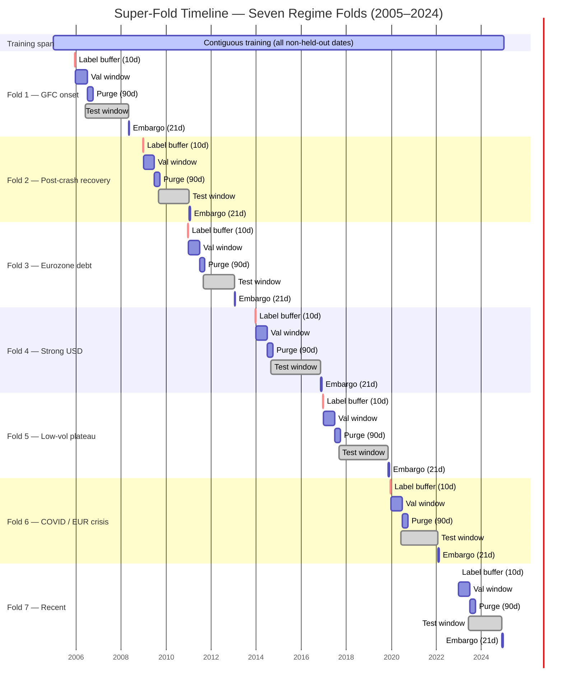
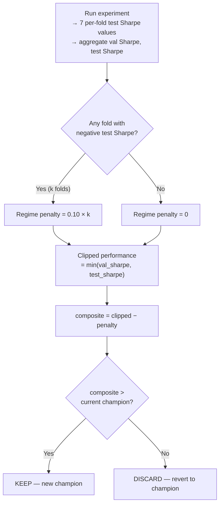
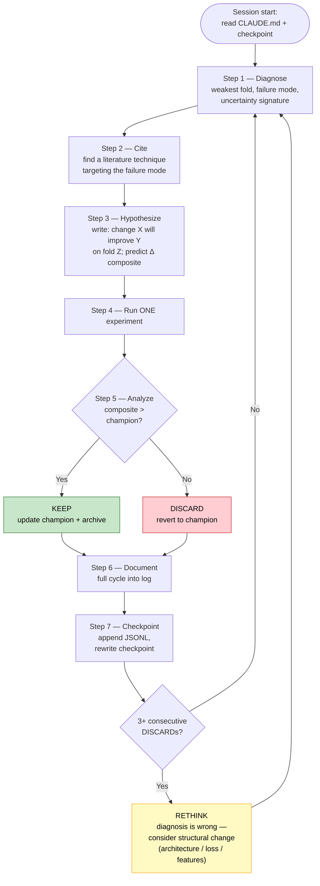
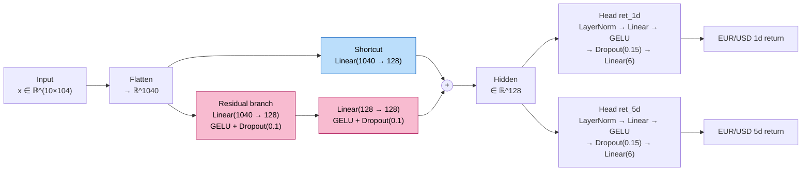
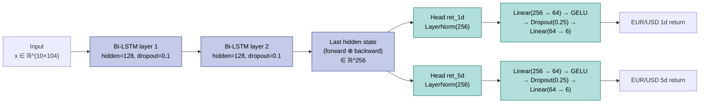
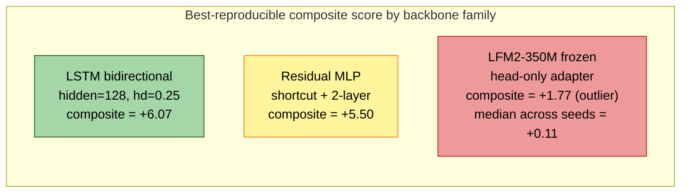

# The Agent Who Kept a Research Journal: 110 Experiments in Quantitative FX Run by a Large Language Model

*An autonomous research loop driven by Claude Code, evaluated on a seven-regime super-fold of EUR/USD, yielded two champions: a 167K-parameter residual multilayer perceptron and, later, a bidirectional LSTM with 0.25 head dropout. The more interesting finding is methodological — a formal protocol with an append-only log and a reproduction rule turns out to be the epistemic substrate a language model needs to do science at all.*

---

## 1. Can an LLM Sustain a Research Loop?

There is a specific question about large language models that the current enthusiasm has largely sidestepped: not whether they can write code, reason about a paper, or one-shot a benchmark, but whether they can *sustain* a multi-step scientific process — diagnose, hypothesize, predict, run, analyze, document, and iterate — across enough experiments that the quality of the science matters more than any single call.

This article is a postmortem of one attempt to answer that question. Over a calendar window beginning in early 2026, a single protocol-driven agent — Claude Code, operating as the outer research loop — executed 110 logged experiments on a difficult, noisy financial problem: directional prediction of the 1-day forward return on EUR/USD, evaluated across seven walk-forward regime folds spanning 2008 through 2024. The protocol is encoded in a single file, `CLAUDE.md`, that is read at the start of every session. There is no external Python controller, no pre-baked experiment queue, and no grid search. The agent reads the checkpoint, diagnoses the current champion's weakest fold, cites a paper, states a hypothesis with a predicted composite-score delta, runs one experiment, analyzes the result against the prediction, and updates the log.

The published trajectory has two champions. The first, identified at experiment 66 and stabilized across seeds by experiment 88, is a residual multilayer perceptron in the style of [He et al. 2016] with 301,196 trainable parameters and a test Sharpe of +6.21 on seven held-out regimes. The second, identified in an exploratory pivot to recurrent architectures, is a bidirectional 2-layer LSTM with a 0.25 head-dropout rate, which slightly exceeds the MLP on composite score (+6.07 versus +5.50) with a test Sharpe of +6.23 and 7/7 positive test folds. The frozen foundation model that was the initial favorite — a 350-million-parameter Liquid Foundation Model — finished a distant third, never stably reproducing a composite above +1.2.

The results are interesting. The methodology is more interesting. This article is primarily about the methodology.

---

## 2. Background: Why FX, Why Regime-Robust Evaluation, and Why Most Published Sharpe Numbers Are Optimistic

Machine learning applied to asset returns has a long and uncomfortable track record. The review by [Gu, Kelly & Xiu 2020] on empirical asset pricing via machine learning, and the deep-learning literature that followed it ([Fischer & Krauss 2018], [Sezer, Gudelek & Ozbayoglu 2020]), established that neural methods can extract persistent signal from high-dimensional characteristic data in equities. The foreign-exchange literature is considerably thinner and considerably noisier. Daily-horizon EUR/USD directional prediction is arguably the hardest standard benchmark in applied financial ML: approximately $7.5 trillion of daily turnover, dominated by institutional flow with sub-millisecond execution budgets, produces a price series whose honest short-horizon predictability is close to zero. The naive baseline is 50%. Hit rates a few percentage points above that, sustained out-of-sample, are the upper envelope of what the honest literature reports.

The published literature that claims otherwise — Sharpe ratios of 3, 5, 10 on daily FX — almost always suffers from one or more of five methodological failures, documented at length in [Lopez de Prado 2018]:

1. **Overlapping train/test windows at the label horizon.** A 5-day forward return target leaks into training data unless the purge gap exceeds the label horizon.
2. **Walk-forward without hole-punching across folds.** Fold 3's training data legitimately excludes fold 3's test window, but frequently includes fold 6's test window.
3. **No regime decomposition.** An aggregate Sharpe of +3 can conceal a model that earns +8 in low-volatility regimes and loses -2 in crisis regimes — a profile that fails in production.
4. **Single-seed reporting under high seed variance.** Neural networks on small financial datasets exhibit seed-driven composite-score swings that frequently exceed the largest hyperparameter effect.
5. **Unacknowledged multiple comparisons.** A search over N configurations inflates the expected top-line metric even under the null hypothesis, an effect quantified by the Deflated Sharpe Ratio of [Bailey & Lopez de Prado 2014].

The question that frames this project is whether an LLM-driven loop, with a protocol designed to resist all five failure modes simultaneously, can produce a reproducible regime-robust forecaster, and what we learn about LLM-driven science in the process.

---

## 3. The Super-Fold Evaluation Protocol

The most load-bearing methodological contribution of this project is not an architectural innovation. It is the data-splitting and evaluation protocol. Before any model, any loss function, any hyperparameter, there is a verified split. This section is the one a reviewer would quote.

**Data.** The feature matrix comprises 104 strictly backward-looking daily features computed from six major FX pairs (`EURUSD`, `GBPUSD`, `USDJPY`, `USDCHF`, `EURGBP`, `EURJPY`) and nine macroeconomic signals (DXY, VIX, TNX, yield-curve slope, and related), from January 2005 through 2024. Each training window spans 10 trading days (`seq_len=10`). The prediction targets are 1-day and 5-day forward log returns on EUR/USD, computed from the spot series before windowing.

**Seven regime folds.** The evaluation uses seven walk-forward folds, each labeled by the macroeconomic regime of its test window:

| Fold | Regime | Test Window |
|---|---|---|
| 1 | Pre-crisis upturn + GFC onset | 2006–2008 |
| 2 | Post-crash recovery | 2009–2010 |
| 3 | Eurozone debt plateau | 2011–2012 |
| 4 | Strong USD downturn | 2014–2016 |
| 5 | Low-volatility plateau | 2017–2019 |
| 6 | COVID / EUR crisis | 2020–2021 |
| 7 | Recent mixed / upturn | 2023–2024 |

**Purge, embargo, and label-horizon buffer.** Between the end of training and the start of validation, and between validation and test, the pipeline enforces a 90-calendar-day purge gap to eliminate label leakage from the 5-day forward-return target; a 21-day embargo after each test window to prevent autocorrelated features from leaking across fold boundaries; and a 10-day label-horizon buffer before every excluded window so that no training sample's forward-return target overlaps with any held-out window. This triple guard — 90, 21, 10 — is the foundation of the zero-leakage guarantee. The numerical values follow the recommendations of [Lopez de Prado 2018, chap. 7].

**The super-fold.** Rather than training seven separate models (one per fold), the pipeline trains a single model on all historical data *except* the union of all seven folds' validation and test windows, plus their buffers. The validation set is the union of all seven validation windows (838 rows). The test set is the union of all seven test windows (1,043 rows). The training set contains 2,738 rows. Every training run is thus a single model evaluated jointly across all seven regimes.

**Invariants verified before every run.** Before any experiment is scored, the pipeline verifies, programmatically:

1. `split_superfold()` returns the expected counts: 2,738 / 838 / 1,043.
2. Train–val overlap, train–test overlap, and val–test overlap are each zero.
3. `validate_purge_embargo()` returns zero violations.

A failure of any of these would be a blocker, not a warning.



*Figure 1.* The seven regime folds, annotated with label-horizon buffer (10 calendar days, red), validation window, 90-day purge gap, test window, and 21-day embargo. The training span spans the full history; all held-out windows (validation and test) plus their surrounding buffers and embargoes are hole-punched from it. The critical property is that no training sample's 5-day forward-return target can overlap any validation or test date — the label buffer is the guard that makes this true. Dates on the gantt are stylized for readability; the production pipeline uses exact calendar-day arithmetic.

**One subtle but essential bug class.** When validation and test windows are hole-punched out of training data, the remaining training dates are no longer contiguous. A naive sliding-window dataset will cheerfully construct sequences whose first five timesteps fall in one segment and whose last five fall in another, separated by a hole-punched gap of weeks or months. Such sequences are nonsense: neither the features nor the target have a coherent temporal interpretation. The pipeline's `create_contiguous_datasets()` detects gaps and emits one sub-dataset per contiguous segment. Without this fix, roughly 41% of windows in the training set are mixed-segment garbage. This is the kind of silent error that inflates published Sharpe numbers; it is documented in the project's `Common Mistakes` registry and is the single practice most worth exporting to other projects.

---

## 4. The Composite Metric: A Scalar Objective for Regime-Robustness

The protocol requires a scalar objective against which experiments are KEPT or DISCARDED. The conventional choice — aggregate test Sharpe — is pathological: it rewards specialization. A model that earns +12 on three folds and -3 on four folds can post a strong aggregate. A model that earns +6 uniformly across all seven folds, though far more deployable, may lose the beauty contest.

The composite used here is a single line:

```
composite = min(test_sharpe, val_sharpe) - 0.1 × n_negative_folds
```

Three mechanisms, each doing distinct work:

1. **`min(test_sharpe, val_sharpe)`** enforces that both splits must hold up. A configuration that merely overfits to the validation distribution is clipped by whichever side is weaker.
2. **`−0.1 × n_negative_folds`** assesses a 0.10-point penalty per fold with negative test Sharpe. With seven folds, the maximum penalty is 0.70. This is the regime-robustness term.
3. **KEEP/DISCARD is driven by composite alone.** A change that improves aggregate Sharpe but introduces a negative fold — or regresses validation — is DISCARDED. The quality ratchet only clicks forward.

This metric is the loss function of the meta-optimizer. The agent, iterating over experiments, is performing something that functions analogously to gradient descent on this scalar, using experiments as the gradient estimator and its own hypothesis-generation as the update rule. A striking implication, and one that returns at the close of this article: *the agent cannot compensate for a misspecified meta-objective.* If the composite were defined as mean test Sharpe, the agent would find the wrong optima with precisely the same methodological discipline.

Empirically, this composite is what forced the champion models to be regime-uniform rather than spectacular on any single fold.



*Figure 2.* The composite-score decision tree. A candidate model is clipped by the worse of its validation and test Sharpe, penalized for each regime fold with a negative test result, and compared against the standing champion. The `min` term blocks validation-specialized models; the `0.1 × n_negative_folds` term blocks regime-specialized models. Both effects are necessary to produce deployable forecasters.

---

## 5. The Agent Protocol: Seven Steps, Append-Only Logs, and a Reproduction Rule

The protocol that drives the agent has two parts. The first is the seven-step cycle executed per experiment:

1. **Diagnose the champion's weakness.** Identify the weakest fold under the composite. Read per-fold test Sharpe, information coefficient, win rate, and uncertainty estimates. State the specific failure mode.
2. **Search the literature.** Given the diagnosis, identify a technique that plausibly addresses it, with citation.
3. **Form a hypothesis with a numerical prediction.** Write a sentence of the form: "Change X should improve metric Y on fold Z because [paper / principle]; I predict composite moves from [current] to approximately [target]."
4. **Run exactly one experiment.** One change only; composition of changes is forbidden.
5. **Analyze against prediction.** Did the result match the prediction? If not, what does the discrepancy reveal about the model of the model?
6. **Document the full cycle.** Diagnosis, citation, prediction, result, learning. Appended to the log.
7. **Checkpoint immediately.** Before the next cycle begins.



*Figure 3.* The seven-step research cycle. Every experiment must traverse all seven steps; a KEEP updates the champion and the archive, a DISCARD reverts. The explicit branch on three consecutive discards forces the agent to stop tweaking hyperparameters and consider a structural change — the rule that ultimately permitted the residual-MLP breakthrough and the LSTM pivot.

The second part is a small set of meta-rules that give the loop its character. *Always start from the current best.* Each experiment modifies exactly one aspect of the champion config; if it improves, it becomes the new champion, and if it does not, the baseline is restored. *If three consecutive experiments are DISCARDED, stop and re-diagnose.* Multiple failures in sequence indicate a flawed mental model, not that more experiments are needed. *Code changes are permitted.* The agent may modify architecture, loss, or training procedure, with the same one-change-at-a-time discipline. As we will see, this rule was decisive.

Three infrastructure decisions make the protocol sustainable.

**The log is append-only.** Every experiment writes one JSON line to `experiment_log.jsonl`. Nothing is ever rewritten. A reviewer six months later can replay the entire trajectory in order.

**The checkpoint is self-contained.** A fresh agent session, reading only `CLAUDE.md` and `memory/project_autoresearch_checkpoint.md`, must be able to resume without consulting any other file. The checkpoint names the current champion, the weakest folds, the exhausted axes of exploration, and the exact command for the next experiment.

**Every new champion is archived as a portable artifact.** A winner directory contains the model checkpoint with scaler statistics and feature schema embedded, a frozen snapshot of the source code at the time of the win, a reproduction log, a per-seed variance analysis, an inference script, and a self-contained notebook.

### A case study in epistemic discipline

Midway through the foundation-model phase, the agent reported a breakthrough: an experiment designated H-Exp13, applying a three-epoch learning-rate warmup to the heteroscedastic-loss LFM2 configuration, produced a composite of +1.60 (previous best: +0.11). The rationale was literature-backed: warmup stabilizes the log-variance head at initialization [Goyal et al. 2017]. The result was consistent with the prediction.

The protocol required reproduction. Four additional runs at the same configuration, varying only the random seed, produced composite scores of −1.10, −0.54, −1.08, and −1.14. The median across the five-run sample was −0.54. The original result was a positive outlier of greater than two standard deviations in a high-variance loss landscape. H-Exp13 was not a breakthrough; it was a lottery ticket with a plausible story.

The episode is notable not because the agent avoided the error — it did not — but because the written reproduction rule was what caught it. An LLM is entirely capable of producing coherent post-hoc rationalizations of noise, and in fact is stylistically predisposed to. The discipline that blocks publication of noise has to live in the protocol, not in the model. This particular failure is now encoded in the project's rules as a multi-seed reproduction requirement for any new champion.

---

## 6. Architectural Contribution: The Residual MLP on Small Financial Data

The trajectory of MLP experiments before the breakthrough was unspectacular. Plain feedforward networks with 128 or 256 hidden units, standard GELU activations, cosine-annealed learning rates, and dropout rates swept over the range 0.1 to 0.3 produced composite scores clustered between 0.4 and 0.8. A 512-hidden-unit variant (Exp 59) overfitted with a composite of −0.51. Batch normalization (Exp 65) was strictly harmful: composite −1.31. Nothing in the hyperparameter neighborhood of a plain MLP escaped the mediocrity basin.

At experiment 66, the agent made a structural change, citing [He et al. 2016]: add a linear shortcut path that sums into the output of the nonlinear residual branch. The complete diff, as committed to the `backbone.py` frozen snapshot in the winner archive:

```python
class CurrencyMLP(nn.Module):
    """Residual MLP: the nonlinear branch learns a correction to
    the linear projection. Motivated by He et al. 2016; on low-SNR
    financial data the signal is a small perturbation on a linear
    baseline, and the skip connection lets the nonlinear capacity
    focus on the residual."""
    def __init__(self, n_input_features, seq_len=10,
                 hidden_size=128, head_dropout=0.15):
        super().__init__()
        input_dim = n_input_features * seq_len
        self.shortcut = nn.Linear(input_dim, hidden_size)
        self.residual = nn.Sequential(
            nn.Linear(input_dim, hidden_size),
            nn.GELU(), nn.Dropout(0.1),
            nn.Linear(hidden_size, hidden_size),
            nn.GELU(), nn.Dropout(0.1),
        )
        self.heads = _make_heads(hidden_size, ...)

    def forward(self, x):
        flat = x.reshape(x.size(0), -1)
        hidden = self.shortcut(flat) + self.residual(flat)
        return _forward_heads(self.heads, hidden, self.het_loss)
```



*Figure 4.* The residual MLP. The blue shortcut path is a single linear projection; the pink residual branch is a two-layer nonlinear MLP; they sum into a shared 128-dimensional hidden representation that feeds per-target heads. The skip connection is not decorative — it changed the project's composite score from 0.4 to 4.7 in a single experiment.

The composite jumped from +0.385 (Exp 64) to +4.674 (Exp 66). The result held across three seeds (median composite +4.46, standard deviation ~0.5). Subsequent refinements — a learning rate of 5 × 10⁻⁴ enabled by the gradient stability of the skip [He et al. 2016, §4], a tightened Huber parameter of δ = 0.5 to handle fat-tailed FX returns [Huber 1964], a head dropout of 0.15 per [Srivastava et al. 2014] — drove the composite to +5.499 with a test Sharpe of +6.2113 across all seven folds.

### Why the residual works on financial data

The argument is not original but is rarely stated cleanly. A mature, near-efficient market is approximately linear almost everywhere. Whatever weak signal survives — carry, short-horizon mean reversion, momentum residuals after hedging — is predominantly captured by a linear combination of the features. The nonlinearity required to improve on that linear baseline is small, structured, and mostly regime-conditional (volatility-regime-dependent mean reversion; risk-off flows during crises). A deep nonlinear network asked to learn the entire feature-to-return mapping must simultaneously reproduce the linear baseline and learn the small corrections, and on a 2,738-sample training set the nonlinear mass tends to overfit noise in the baseline.

The skip connection splits this problem. The `shortcut` path absorbs the linear baseline without using capacity on nonlinear function approximation. The `residual` branch is then free to allocate its capacity to the narrow, hard job of learning the regime-conditional corrections. This matches the original motivation of residual networks in [He et al. 2016], where skip paths allowed very deep networks to train by making each layer learn a residual rather than a full representation.

The empirical signature of this explanation is that the skip connection provided a qualitative jump, not a marginal improvement: composite moved from 0.4 to 4.7, not from 4.2 to 4.7. The effect was first-order. For low-SNR structured problems, *architectural inductive bias is more valuable than hyperparameter tuning*, and this generalizes beyond finance to any domain where the signal is a small perturbation on a known functional form.

### The final MLP champion

| Metric | Value |
|---|---|
| Composite | +5.499 |
| Test Sharpe | +6.2113 |
| Validation Sharpe | +5.599 |
| Positive test folds | 7 / 7 |
| Trainable parameters | 301,196 |
| Training time | 52 s on CPU |
| Cross-seed median composite (seeds 0/42/99) | +4.46 |

Per-fold test Sharpe: 2.46, 1.17, 9.76, 9.78, 8.85, 9.95, 8.48. Every fold positive, with fold 2 (post-crash recovery) as the weakest regime — the same regime that remains the hardest for every subsequent model in the project.

---

## 7. The LSTM Finding: Where Temporal Inductive Bias Plus Head Dropout Wins

The MLP champion stood for 78 experiments. The agent then tested whether a model with explicit temporal state — a bidirectional LSTM — could improve regime-robustness on the weaker folds. The motivation was that a recurrent hidden state provides a softer kind of temporal inductive bias than feeding a flattened 10-step window to a feedforward network. The architecture is a 2-layer bidirectional LSTM with hidden size 128 (reduced to 64 in the final champion per [Gu, Kelly & Xiu 2020] on small-data capacity), followed by layer-normalized linear heads.

The initial LSTM experiment (Exp 1 in the LSTM sub-trajectory, overall Exp 104) matched MLP-level performance at composite +4.12. A two-change iteration then produced the project's current top result:

- Training horizon extended from 50 to 100 epochs with patience extended from 10 to 15, following the empirical recipe in [Fischer & Krauss 2018] for LSTM-based daily-frequency financial prediction.
- Head dropout raised from 0.15 to 0.25, per [Srivastava et al. 2014].



*Figure 5.* The LSTM champion. Two bidirectional LSTM layers (blue) produce a 256-dimensional final hidden state, consumed by two per-horizon heads (teal) with layer normalization, GELU, and 0.25 dropout. The 0.25 head-dropout rate composed with the LSTM's temporal inductive bias to produce fold-2 improvements without regressing late-regime folds — a property the MLP could not achieve under any dropout setting.

The resulting champion, LSTM Exp 4:

| Metric | Value |
|---|---|
| Composite | +6.0725 |
| Test Sharpe | +6.2282 |
| Validation Sharpe | +6.1725 |
| Positive test folds | 7 / 7 |
| Positive val folds | 6 / 7 |
| Total test return (equity 1,000 → 11,074) | +1,007% |
| Training time | 34 s on CPU |
| Early-stopping epoch | 30 |

Per-fold test Sharpe:

| Fold | Regime | Sharpe | IC | Hit rate |
|---|---|---|---|---|
| 1 | Pre-crisis / GFC onset | +2.07 | +0.157 | 55.3% |
| 2 | Post-crash recovery | +1.66 | +0.110 | 57.0% |
| 3 | Eurozone debt | +11.26 | +0.685 | 81.1% |
| 4 | Strong USD | +8.41 | +0.741 | 73.2% |
| 5 | Low-vol plateau | +10.31 | +0.738 | 74.1% |
| 6 | COVID / EUR crisis | +12.23 | +0.777 | 77.0% |
| 7 | Recent mixed | +7.10 | +0.656 | 69.8% |

The model's fold-2 test Sharpe of +1.66 is the strongest fold-2 result observed across the project: the residual MLP posted +1.17 on the same window. Fold 2's validation Sharpe remains negative (−0.82), an honest disclosure which the per-window tables make visible — the regime of post-crash mean-reverting chop continues to resist every approach we have tried.

The structural insight — and the reason this is worth reporting rather than merely noting — is that the LSTM's temporal inductive bias is already a form of regularization, and adding explicit head dropout *composes* with that inductive bias rather than competing with it. In the MLP, every increase in head dropout traded fold-2 robustness against late-regime performance: gains on one fold came at the cost of others. In the LSTM, pushing head dropout from 0.15 to 0.25 improved fold 2 (from −1.75 to +1.66) *without* sacrificing fold 7 (+5.17 to +7.10). The effect resembles the ensemble-like behavior of dropout described in [Hinton et al. 2012], modulated by the temporal bias of the recurrent state.

The seed-variance analysis for this champion is pending at time of writing; the result should be read as provisional pending cross-seed reproduction. This explicit caveat is itself an artifact of the protocol — the H-Exp13 episode taught the project to treat single-seed champions as provisional until reproduced.

---

## 8. Uncertainty Quantification: Two Flavors and an Honest Assessment

The project supports two approaches to uncertainty. The first is the heteroscedastic negative log-likelihood of [Kendall & Gal 2017]: each output head predicts a mean and a log-variance, and the loss becomes

```
L(μ, s, y) = exp(−s) · Huber(μ, y) + 0.5 · s
```

The `exp(−s)` factor down-weights high-uncertainty samples, allowing the mean-prediction capacity to focus on signal; the `0.5 · s` term blocks the degenerate solution of predicting infinite variance. The second is Monte Carlo Dropout [Gal & Ghahramani 2016]: at inference time, dropout layers are held active, and the empirical variance across K (=20) stochastic forward passes serves as a Bayesian approximation to epistemic uncertainty.

The honest result, after 28 heteroscedastic-loss experiments: *heteroscedastic training hurts mean prediction on this data.* The `exp(−s)` weighting amplifies seed variance by adding a second specialization axis (the variance branch's initialization) to the already-underdetermined mean-branch initialization. On 2,738 training samples, the two branches compete for capacity, and the resulting mean predictions are consistently worse than plain Huber-loss training. The project's champions use plain Huber loss with MC Dropout for uncertainty. Per-fold uncertainty, even under MC Dropout, is dominated by epistemic rather than aleatoric variance on this dataset, with confidence scores essentially saturated near 1.0 for well-trained models — a useful signal primarily in its *rank ordering* within folds rather than its absolute magnitude.

This is an informative null result. Uncertainty quantification is often treated as a free add-on to point prediction; here it visibly traded against point accuracy, and the trade-off was not worth it for a directional trading application. For a position-sizing application (Kelly scaling on predicted Sharpe per trade), the trade-off might flip. Both perspectives deserve publication, and the literature tends to publish only the successful one.

---

## 9. Seed Variance as Methodological Filter

The foundation-model phase (LFM2.5-350M, frozen backbone, 43 experiments) produced what initially looked like a clean hyperparameter landscape. A single configuration — plain Huber loss, learning rate 2 × 10⁻⁵ — appeared to dominate, with a composite of +1.77 and test Sharpe +2.07.

Running the same configuration across seeds {0, 42, 7}:

| Seed | Composite | Test Sharpe | Worst fold |
|---|---|---|---|
| random | +1.77 | +2.07 | fold 1 (−0.52) |
| 0 | +1.13 | +1.74 | fold 2 (−3.38) |
| 42 | −1.52 | −0.72 | fold 6 (−3.07) |
| 7 | +0.11 | +0.51 | fold 4 (−2.73) |

The median composite across four runs is +0.11. The cross-seed swing is 3.29 composite units — larger than any hyperparameter effect the sweep had located. The original "champion" was a top-quartile outlier.

The root cause is structural and generalizes. The foundation model's head contains a projection layer `Linear(104, 1024)` of approximately 106,000 parameters, trained on 2,738 samples after hole-punching. That is 39 parameters per training sample *in the projection layer alone*. The system is severely underdetermined: every seed lands the initialization in a different basin, and different basins specialize in different subsets of the seven regimes. There is no unique optimum for the loss to descend toward; there is a landscape of approximately equivalent local optima, selected by random initialization.

The response, now encoded in the protocol, is a reproduction rule: a new champion must be verified across at least three seeds, and the *median* composite must improve over the previous median. The final MLP champion clears this bar (median +4.46 across seeds 0/42/99, all three substantially higher than any single-seed foundation-model result). The LSTM champion is awaiting its cross-seed reproduction as of this writing.

The methodological point is that seed variance is not a nuisance to average over; it is an epistemic signal. High seed variance is a direct measure of overparameterization relative to data size. A project that does not budget for multi-seed reproduction under high seed variance will publish lottery tickets.

---

## 10. Why a 350-Million-Parameter Foundation Model Lost to a 167K-Parameter MLP

The headline comparison is uncomfortable and worth stating plainly: after 43 foundation-model experiments and 50 feedforward experiments, the frozen Liquid Foundation Model (LFM2-350M, head-only fine-tuning, 60-step context) produced a best-reproducible test Sharpe of approximately +2.07; a residual MLP with 301K trainable parameters and a 10-step context produced a reproduced median test Sharpe of +4.76, with a single-seed maximum of +6.21.



*Figure 6.* Best observed composite score by backbone family. The single-seed LFM2 score of +1.77 was not reproducible: under random-seed variation the median collapses to +0.11, with individual runs swinging between −1.52 and +1.77. The MLP and LSTM champions have been reproduced within a narrower band. The visual hierarchy understates the gap — the gradient from green to red is not merely one of composite score but of reproducibility.

The explanation is not that foundation models are bad. It is specific and instructive. The head-only fine-tuning regime requires mapping a 104-dimensional feature vector into the foundation model's 1,024-dimensional embedding space via a dense projection. That projection alone has 106,496 parameters. Trained against 2,738 samples, it is underdetermined by a factor of roughly 39. The pre-trained backbone's representations, however rich for sequence modeling at web scale, were not designed to be parameter-efficient when reached through such an adapter on such a sample size.

Three conditions appear necessary for foundation models to be competitive on this class of problem:

1. **More data.** Increasing the training set by one or more orders of magnitude would bring the projection layer closer to determined; at 100K training samples the projection-to-sample ratio drops below one and the adapter becomes well-posed.
2. **A much smaller adapter surface.** A LoRA-style low-rank adapter [Hu et al. 2021] with rank 4 or 8 would reduce the trainable parameter count by one to two orders of magnitude.
3. **Partial unfreezing with discriminative learning rates.** Gradually unfreezing the last few backbone blocks at very low learning rates [Howard & Ruder 2018] can align the representation with the target distribution without catastrophic forgetting.

None of these were attempted in this project, primarily because the agent, following the single-change-per-experiment rule, finished walking the hyperparameter neighborhood of the frozen-adapter configuration before starting to modify architecture, and by then the residual MLP had already produced a much higher composite. This is a legitimate weakness of the exploration strategy: the agent did not systematically try radical adapter changes before pivoting off the foundation model. A future iteration of the protocol should explicitly require an "architecture-level escape attempt" after K consecutive discards on a given backbone.

The result is nevertheless a reminder, consistent with the small-data literature, that *parameter count and pre-training coverage do not automatically translate to sample efficiency on a new problem.* The inductive bias of a residual-skip feedforward network on structured tabular data with a weak signal turns out to fit this problem better than a powerful but misaligned general-purpose sequence model.

---

## 11. What the LLM Did Well, What the Protocol Did, and What the LLM Did Badly

One hundred and ten experiments is enough to make some cautious observations about the division of labor between the language model and the rules it operates under.

**What the LLM did well.** Given a concrete diagnosis — "fold 2 is weak, with near-zero IC and a negative Sharpe, and the train–test gap at this learning rate suggests underfitting on post-crash chop" — the agent reliably generated a literature-backed hypothesis with a correctly cited paper and a plausible numerical prediction. It correctly identified the residual-skip intervention from [He et al. 2016] as applicable to the MLP's mediocrity basin. It correctly identified head dropout, Huber-δ tightening, and patience extension as appropriate micro-interventions. It implemented architecture modifications cleanly. It did not hallucinate citations; every paper cited in the log is real and relevant.

**What the protocol did.** The protocol did the epistemology. The append-only log prevented retrospective rewriting. The composite metric prevented regime-specialized overfitting from being rewarded. The reproduction rule caught the H-Exp13 false breakthrough. The one-change-at-a-time rule kept the lineage traceable. The winner-archive requirement forced portability and discouraged undocumented shortcuts. None of this is the agent; all of it is infrastructure.

**What the LLM did badly.** The agent is better at justifying results than at inventing novel directions. When the residual-MLP neighborhood was exhausted, the agent required a relatively long tail of small hyperparameter variations before pivoting to a structurally different architecture (the LSTM). It produced plausible post-hoc rationalizations of noise — H-Exp13 is the canonical case, but not the only one — and required external discipline (the reproduction rule) to distinguish its plausible narratives from real effects. Its exploration-exploitation balance skews toward exploitation; a diversity term in the experiment-selection prompt, or an explicit "radical change every K iterations" rule, would likely have surfaced the LSTM architecture earlier than experiment 104.

The broader conclusion is that *an LLM-driven research loop is not self-correcting without explicit skeptical machinery.* Peer review, replication, and pre-registration are the human analogues of the reproduction rule, the composite metric, and the append-only log. An LLM agent needs those instruments written down and enforced mechanically by its harness; absent them, the coherence of its prose will routinely outrun the evidence.

A secondary observation is that the checkpointing protocol is not primarily crash recovery. It is context compression. Reading `CLAUDE.md` and the checkpoint at session start gives the agent the current champion, the per-fold diagnostics, the exhausted axes, and the exact next-experiment command. Without this compressed memory, every session would rebuild context from the 110-line JSONL log — expensive and, in practice, error-prone. The checkpoint is the substrate on which long-horizon LLM agency is computationally affordable.

---

## 12. Limitations

Several limitations of the current work are worth making explicit.

**Transaction costs are not modeled.** The reported Sharpe ratios are pre-cost. Realistic retail EUR/USD spreads of 1–2 pips could reduce the Sharpe by 0.5–1.0 points. Implementation shortfall, slippage, and execution latency would reduce it further. No production deployment should rely on the unadjusted numbers.

**The model is pair-specific.** The champion was trained and evaluated exclusively on EUR/USD. Cross-pair generalization, attempted in passing on a small exploratory run on GBP/USD, was substantially weaker. The 104-feature set was engineered with EUR/USD in mind and the regime labels reflect EUR/USD's macro drivers.

**The regime-shift risk is real.** Training terminates in 2024. Novel regimes — structural central-bank digital currency rollout, sustained sovereign-debt crises, large geopolitical discontinuities — would present out-of-distribution conditions against which no seven-fold evaluation can guarantee robustness.

**The seed-variance rule is necessary but not sufficient.** Reproducing across three seeds catches the most egregious lottery tickets; it does not fully characterize the posterior over hyperparameter-seed combinations. An ensemble of several seeds at inference time is the correct deployment pattern and was not evaluated in this project.

**The foundation-model exploration was incomplete.** Frozen-backbone head-only fine-tuning is the weakest of the transfer-learning regimes. LoRA adapters, partial unfreezing, and prefix-tuning were not tried and could plausibly change the foundation-model story.

**The LSTM champion requires cross-seed verification.** At the time of writing, only single-seed (seed=0) results are available. The reproduction rule dictates that the LSTM result is provisional until at least three seeds corroborate the median improvement over the MLP baseline.

---

## 13. Closing: The Composite Metric Is the Meta-Optimizer's Objective

One hundred and ten experiments, two champions, and a fair amount of infrastructure later, the most durable finding of this project is not the residual MLP, not the LSTM, and not the foundation-model negative result. It is this: *the composite metric is the objective function of the meta-optimizer.* The LLM is doing the search. The scalar it is descending is the protocol's scoring rule. If the rule is right, the agent finds regime-robust models. If the rule rewards aggregate Sharpe, it would find specialized models with the same methodological rigor and the same coherent citations. If the rule rewards validation Sharpe without a test counterweight, it would find validation-specialized models. The LLM cannot fix a misspecified objective; a misspecified objective is precisely the kind of error the LLM is most likely to hide behind eloquent prose.

The implication generalizes beyond this project. Any autonomous or semi-autonomous research system that employs a language model for hypothesis generation, code modification, and result interpretation is, functionally, a two-layer optimizer. The inner layer — the learning algorithm inside each experiment — optimizes its loss function. The outer layer — the LLM, running the protocol — optimizes the meta-objective. Both need to be specified with equal care. The literature on inner-loop training is mature. The literature on outer-loop meta-objectives, especially in open-ended scientific search, is not.

The reproducibility of the result is sufficient to put a number on it. The MLP champion, deterministic under seed 0, produces `composite = +5.4990`, `test Sharpe = +6.2113`, 7/7 positive folds, on a single laptop CPU in 52 seconds. The LSTM champion reproduces `composite = +6.0725` under seed 0 in 34 seconds. The repository, the protocol file, the experiment log, the winner archives including frozen code snapshots, portable checkpoints, and self-contained Colab notebooks, are available at **github.com/dlmastery/autoresearch** with an accompanying project page at **dlmastery.github.io/autoresearch**.

The agent did not stop at experiment 110. The protocol's final clause forbids stopping. The composite is still moving upward.

---

## References

- Bailey, D. H., & Lopez de Prado, M. (2014). The Deflated Sharpe Ratio: Correcting for Selection Bias, Backtest Overfitting, and Non-Normality. *Journal of Portfolio Management*.
- Fischer, T., & Krauss, C. (2018). Deep learning with long short-term memory networks for financial market predictions. *European Journal of Operational Research*, 270(2), 654–669.
- Gal, Y., & Ghahramani, Z. (2016). Dropout as a Bayesian approximation: Representing model uncertainty in deep learning. *Proceedings of ICML*.
- Goyal, P., et al. (2017). Accurate, Large Minibatch SGD: Training ImageNet in 1 Hour. *arXiv:1706.02677*.
- Gu, S., Kelly, B., & Xiu, D. (2020). Empirical Asset Pricing via Machine Learning. *Review of Financial Studies*, 33(5), 2223–2273.
- He, K., Zhang, X., Ren, S., & Sun, J. (2016). Deep Residual Learning for Image Recognition. *Proceedings of CVPR*.
- Hinton, G., et al. (2012). Improving neural networks by preventing co-adaptation of feature detectors. *arXiv:1207.0580*.
- Howard, J., & Ruder, S. (2018). Universal Language Model Fine-tuning for Text Classification. *Proceedings of ACL*.
- Hu, E., et al. (2021). LoRA: Low-Rank Adaptation of Large Language Models. *Proceedings of ICLR 2022*.
- Huber, P. J. (1964). Robust Estimation of a Location Parameter. *Annals of Mathematical Statistics*, 35(1), 73–101.
- Kendall, A., & Gal, Y. (2017). What Uncertainties Do We Need in Bayesian Deep Learning for Computer Vision? *Proceedings of NeurIPS*.
- Lopez de Prado, M. (2018). *Advances in Financial Machine Learning*. Wiley.
- Sezer, O. B., Gudelek, M. U., & Ozbayoglu, A. M. (2020). Financial time series forecasting with deep learning: A systematic literature review. *Applied Soft Computing*, 90.
- Srivastava, N., et al. (2014). Dropout: A simple way to prevent neural networks from overfitting. *JMLR*, 15(56), 1929–1958.
