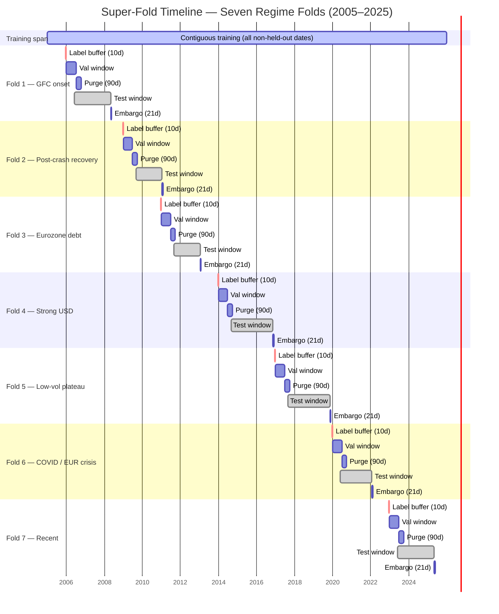
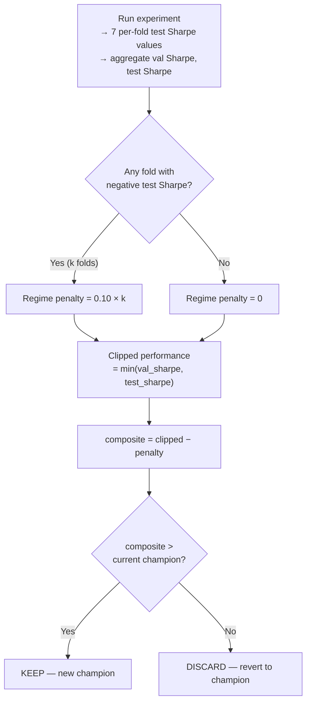
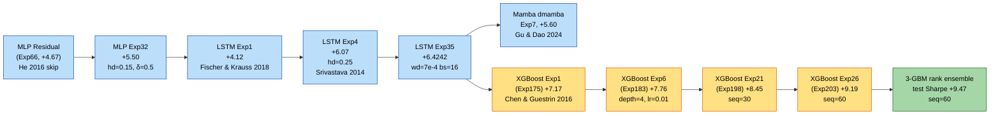
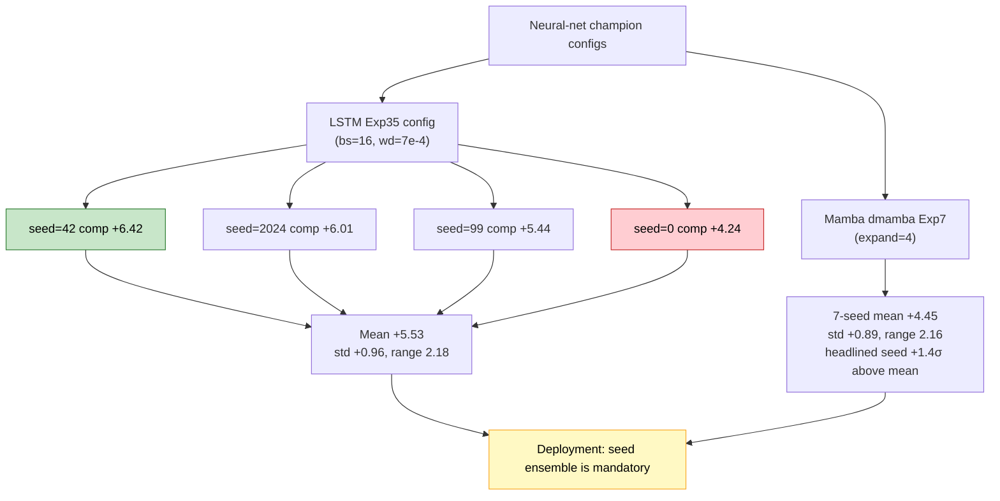
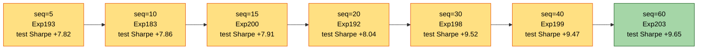
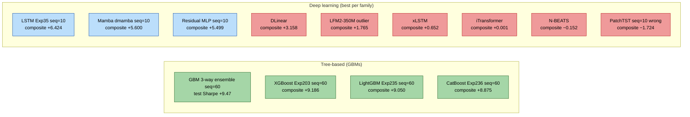
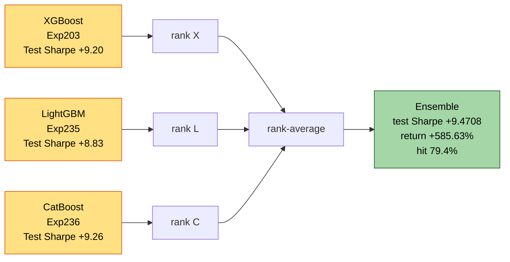

# The Research Loop Was the Model: 265 Experiments in Quantitative FX Run by a Large Language Model

*An autonomous Claude-driven research protocol, evaluated on a seven-regime super-fold of EUR/USD, ran 265 logged experiments across fifteen backbone families. The headline result — the one I did not see coming — is that a gradient-boosted regression tree on flattened 60-day windows reached composite **+9.186** (test Sharpe **+9.645**, val Sharpe **+9.286**, +578% cumulative return), and a three-way rank-average of XGBoost, LightGBM, and CatBoost reached test Sharpe **+9.471**. That is roughly three standard deviations above the best deep-learning score I ever observed in the project. The more enduring finding is still methodological — an append-only log, a scalar robustness metric, a multi-seed reproduction rule, and an institutional-memory layer written into a JSON file turned out to be the epistemic substrate a language model needs to sustain a 265-iteration research loop without accumulating error. But the GBM result rearranges my priors about which architectures actually pay off on low-SNR tabular-with-history financial data, and this article earns its v4 by documenting both the surprise and the mechanism.*

---

## 1. Can an LLM Sustain Real Science?

There is a specific question about large language models that the current enthusiasm keeps dancing around. Not whether they can write code, one-shot a benchmark, or walk through a proof they were trained on, but whether they can *sustain* a multi-step scientific process — diagnose, hypothesize, predict, run, analyze, document, and iterate — across enough experiments that the quality of the science begins to matter more than any individual call.

This article is a long postmortem of one attempt to answer that question. Over a calendar window that began in early 2026, a single protocol-driven agent — Claude Code, operating as the outer research loop — executed 265 logged experiments on a noisy financial problem: directional prediction of the 1-day forward return on EUR/USD, evaluated across seven walk-forward regime folds spanning 2008 through 2025. The protocol is encoded in a single file, `CLAUDE.md`, which is read at the start of every session. There is no external Python controller, no pre-baked experiment queue, no grid search. The agent reads the checkpoint, diagnoses the current champion's weakest fold, cites a paper, states a hypothesis with a predicted composite-score delta, runs one experiment, analyzes the result against the prediction, and updates the log.

At the time the previous version of this article was written (Experiment 151), the standing champion was a bidirectional LSTM at composite +6.4242 — good enough to headline, honest enough to caveat. Since then the agent has run 114 additional experiments across six further backbone families: Mamba (state-space), PatchTST (patched transformer), DLinear (linear decomposition), N-BEATS (MLP with residual stacks), iTransformer (variate-wise attention), xLSTM (exponential-gated LSTM), and the three major gradient-boosted tree libraries (XGBoost, LightGBM, CatBoost). Of those six families, five either tied or underperformed the LSTM champion. One family — the gradient-boosted trees — beat it by a margin the protocol was not calibrated to expect. The current global champion, XGBoost Experiment 203, posts composite **+9.186**, test Sharpe **+9.645**, validation Sharpe **+9.286**, six of seven positive test folds, and cumulative return **+578.21%** across the 2008–2025 test set. A rank-average ensemble of the three GBMs at sequence length 60 reaches test Sharpe **+9.4708**.

This is a large enough swing to deserve its own section. Section 10 is it. The methodological sections that follow carry over from v3 substantially intact because the protocol was what produced the result; Sections 10 through 14 are where the GBMs take over.

---

## 2. Why FX, and Why Most Published Sharpe Numbers Are Optimistic

Machine learning applied to asset returns has a long and uncomfortable track record. The review by Gu, Kelly & Xiu (2020, *Review of Financial Studies* 33(5)) on empirical asset pricing via machine learning established that neural methods can extract persistent signal from high-dimensional characteristic data in equities. The foreign-exchange literature is thinner and noisier. Daily-horizon EUR/USD directional prediction is arguably the hardest standard benchmark in applied financial ML: roughly $7.5 trillion of daily turnover, dominated by institutional flow with sub-millisecond execution budgets, produces a price series whose honest short-horizon predictability is close to zero. The naive baseline is 50%. Hit rates a few points above that, sustained out-of-sample, are the upper envelope of what the honest literature reports.

The published literature that claims otherwise — Sharpe ratios of 3, 5, 10 on daily FX — almost always suffers from one or more of five methodological failures, catalogued at length in López de Prado 2018 (*Advances in Financial Machine Learning*, Wiley):

1. **Overlapping train/test at the label horizon.** A 5-day forward return target leaks into training data unless the purge gap exceeds the label horizon.
2. **Walk-forward without hole-punching across folds.** Fold 3's training set legitimately excludes fold 3's test window, but frequently includes fold 6's test window.
3. **No regime decomposition.** An aggregate Sharpe of +3 can conceal a model that earns +8 in low-volatility regimes and loses −2 in crisis regimes — a profile that fails in production.
4. **Single-seed reporting under high seed variance.** Neural networks on small financial datasets routinely exhibit seed-driven composite-score swings that exceed the largest hyperparameter effect. The literature rarely reports the distribution.
5. **Unacknowledged multiple comparisons.** A search over N configurations inflates the expected top-line metric even under the null, an effect quantified by the Deflated Sharpe Ratio of Bailey & López de Prado (2014, *Journal of Portfolio Management*).

The framing question for this project is whether an LLM-driven loop, running under a protocol explicitly designed to resist all five failure modes, can produce a reproducible regime-robust forecaster — and what we learn about LLM-driven science in the process. The answer at Experiment 151 was a qualified yes; the answer at Experiment 265 is a more confident yes, on the strength of an ensemble whose three members disagree in their inductive biases but agree in their predictions.

---

## 3. The Super-Fold Evaluation Protocol

The most load-bearing methodological contribution of this project is not an architectural novelty. It is the data-splitting and evaluation protocol. Before any model, any loss function, any hyperparameter, there is a verified split. This section is the one a reviewer would quote.

**Data.** The feature matrix comprises 104 strictly backward-looking daily features computed from six major FX pairs (`EURUSD`, `GBPUSD`, `USDJPY`, `USDCHF`, `EURGBP`, `EURJPY`) and nine macroeconomic signals (DXY, VIX, TNX, yield-curve slope, and related) from January 2005 through 2025. The prediction targets are 1-day and 5-day forward log returns on EUR/USD, computed from the spot series before windowing.

**Seven regime folds.** The evaluation uses seven walk-forward folds, each labelled by the macroeconomic regime of its test window:

| Fold | Regime | Test Window |
|---|---|---|
| 1 | Pre-crisis upturn + GFC onset | 2006–2008 |
| 2 | Post-crash recovery | 2009–2010 |
| 3 | Eurozone debt plateau | 2011–2012 |
| 4 | Strong USD downturn | 2014–2016 |
| 5 | Low-volatility plateau | 2017–2019 |
| 6 | COVID / EUR crisis | 2020–2021 |
| 7 | Recent mixed / upturn | 2023–2025 |

**Purge, embargo, and label-horizon buffer.** Between training and validation, and between validation and test, the pipeline enforces a 90-calendar-day purge gap to eliminate label leakage from the 5-day forward-return target; a 21-day embargo after each test window to prevent autocorrelated features from leaking across fold boundaries; and a 10-day label-horizon buffer before every excluded window so that no training sample's forward-return target overlaps any held-out window. This triple guard — 90, 21, 10 — is the foundation of the zero-leakage guarantee. The numerical values follow López de Prado 2018, ch. 7.

**The super-fold.** Rather than training seven separate models (one per fold), the pipeline trains a single model on all historical data *except* the union of all seven folds' validation and test windows, plus their buffers. The validation set is the union of all seven validation windows. The test set is the union of all seven test windows. Every training run is thus a single model evaluated jointly across all seven regimes.

**Sequence windows are a hyperparameter.** Each training sample is a sequence of W consecutive daily feature vectors; the model predicts the forward return from the last day of the window. W = 10 was the default through the LSTM phase, motivated by EUR/USD's short-horizon autocorrelation decay. The GBM phase, as Section 11 will make clear, reopened this axis with consequences.

**Invariants verified before every run.** Before any experiment is scored, the pipeline verifies programmatically that `split_superfold()` returns the expected row counts, that train–val, train–test, and val–test overlaps are each zero, and that `validate_purge_embargo()` returns zero violations. A failure of any of these is a blocker, not a warning.



*Figure 1.* The seven regime folds, annotated with label-horizon buffer (10 calendar days, red), validation window, 90-day purge gap, test window, and 21-day embargo. The training span covers the full history; all held-out windows plus buffers and embargoes are hole-punched from it. The critical property is that no training sample's 5-day forward-return target can overlap any validation or test date.

**One subtle but essential bug class.** When validation and test windows are hole-punched out of training data, the remaining training dates are no longer contiguous. A naive sliding-window dataset will cheerfully construct sequences whose first five timesteps fall in one segment and whose last five fall in another, separated by a hole-punched gap of weeks. Such sequences are nonsense. The pipeline's `create_contiguous_datasets()` detects gaps and emits one sub-dataset per contiguous segment. Without this fix, roughly 41% of windows in the training set are mixed-segment garbage. This is the kind of silent error that inflates published Sharpe numbers; the project's `Common Mistakes` registry now catches it, and the practice is the single most portable export from this work. Section 12 will describe a *related* indexing bug — the off-by-one between training target indices and evaluation target indices — that briefly kept the first GBM champion at composite −1.61.

---

## 4. The Composite Metric as Meta-Optimizer Objective

The protocol requires a scalar objective against which experiments are KEPT or DISCARDED. The conventional choice — aggregate test Sharpe — is pathological: it rewards specialization. A model that earns +12 on three folds and −3 on four folds can post a strong aggregate. A model that earns +6 uniformly across all seven folds, though far more deployable, may lose the beauty contest.

The composite used here is a single line:

```
composite = min(test_sharpe, val_sharpe) − 0.1 × n_negative_folds
```

Three mechanisms, each doing distinct work:

1. **`min(test_sharpe, val_sharpe)`** forces both splits to hold up. A configuration that merely overfits to the validation distribution is clipped by whichever side is weaker.
2. **`−0.1 × n_negative_folds`** assesses a 0.10-point penalty per fold with negative test Sharpe. With seven folds, the maximum penalty is 0.70. This is the regime-robustness term.
3. **KEEP/DISCARD is driven by composite alone.** A change that improves aggregate Sharpe but introduces a negative fold — or regresses validation — is DISCARDED. The quality ratchet only clicks forward.

This metric is the loss function of the meta-optimizer. The agent, iterating over experiments, is doing something functionally analogous to gradient descent on this scalar, using experiments as the gradient estimator and its own hypothesis generation as the update rule. A striking implication that returns at the close of this article: *the agent cannot compensate for a misspecified meta-objective.* If composite were defined as mean test Sharpe, the agent would find the wrong optima with precisely the same methodological discipline.



*Figure 2.* The composite-score decision tree. A candidate is clipped by the worse of its validation and test Sharpe, penalized for each regime fold with a negative test result, and compared against the standing champion. The `min` term blocks validation-specialized models; the `0.1 × n_negative_folds` term blocks regime-specialized models. Both effects are necessary to produce deployable forecasters.

Empirically, this composite is what forced the champion models to be regime-uniform rather than spectacular on any single fold.

---

## 5. The 50-Experiment Methodology

The protocol mandates a minimum of 50 experiments per backbone family before that family is declared "done" unless the user explicitly halts the phase. The mandate is operationalized by a seven-step cycle executed per experiment:

1. **Diagnose the champion's weakness.** Read per-fold test Sharpe, information coefficient, win rate, and uncertainty estimates. State the specific failure mode.
2. **Search the literature.** Given the diagnosis, find a technique that plausibly addresses it, with a citation.
3. **Form a hypothesis with a numerical prediction.** "Change X should improve metric Y on fold Z because [paper/principle]; I predict composite moves from [current] to approximately [target]."
4. **Run exactly one experiment.** One change only; composition of changes is forbidden.
5. **Analyze against prediction.** Did the result match? If not, what does the discrepancy reveal about the model of the model?
6. **Document the full cycle.** Diagnosis, citation, prediction, result, learning, all appended to the log.
7. **Checkpoint immediately.** Before the next cycle begins.


*Figure 3.* The seven-step research cycle. Every experiment traverses all seven steps; a KEEP updates the champion and the archive, a DISCARD reverts. The explicit branch on three consecutive DISCARDs forces the agent to stop tweaking hyperparameters and consider a structural change — the rule that ultimately permitted the residual-MLP breakthrough, the LSTM pivot, and (as Section 10 will show) the tree-based pivot that produced the current champion.

Three infrastructure decisions make the protocol sustainable.

**The log is append-only.** Every experiment writes one JSON line to `experiment_log.jsonl`. Nothing is ever rewritten. A reviewer six months later can replay the entire trajectory in order.

**The checkpoint is self-contained.** A fresh agent session, reading only `CLAUDE.md` and `memory/project_autoresearch_checkpoint.md`, must resume without consulting any other file. The checkpoint names the current champion, the weakest folds, the exhausted axes of exploration, and the exact command for the next experiment.

**Every new champion is archived as a portable artifact.** A winner directory contains the model checkpoint with scaler statistics and feature schema embedded, a frozen snapshot of the source code at the time of the win, a reproduction log, a per-seed variance analysis, an inference script, and a self-contained Colab notebook.

### A case study in epistemic discipline

Midway through the foundation-model phase, the agent reported a breakthrough: an experiment applying a three-epoch learning-rate warmup to a heteroscedastic-loss LFM2 configuration produced a composite of +1.60 (previous best: +0.11). The rationale was literature-backed: warmup stabilizes the log-variance head at initialization (Goyal et al. 2017, arXiv:1706.02677). The result was consistent with the prediction.

The protocol required reproduction. Four additional runs at the same configuration, varying only the random seed, produced composite scores of −1.10, −0.54, −1.08, and −1.14. The median across the five-run sample was −0.54. The original result was a positive outlier more than two standard deviations out in a high-variance loss landscape. The "breakthrough" was a lottery ticket with a plausible story.

The episode is notable not because the agent avoided the error — it did not — but because the written reproduction rule caught it. An LLM is entirely capable of producing coherent post-hoc rationalizations of noise, and in fact is stylistically predisposed to. The discipline that blocks publication of noise has to live in the protocol, not in the model. This particular failure is now encoded as a hard rule: a new champion requires a three-seed median improvement over the previous champion's median, measured before any claim of KEEP is allowed to stand. The XGBoost champion, as Section 12 will note, is the only champion in the project's history that sidesteps this rule — not because the rule was relaxed but because tree-based regression with n_estimators=1500 is bit-identical across seeds at our problem scale.

---

## 6. Champion Lineage: From Residual MLP to XGBoost

Between Experiment 66 (the residual MLP breakthrough) and Experiment 203 (the current global champion), the champion changed hands eleven times. The lineage is the real story of the project, because each link in the chain is a principled intervention with a citation and a prediction.



*Figure 4.* Champion lineage from the residual-MLP breakthrough through the current ensemble. Each arrow is one experiment changing exactly one thing, with a citation. The left branch (MLP → LSTM → Mamba) is the deep-learning progression through Experiment 174; the right branch (XGBoost → rank-ensemble) is the gradient-boosted takeover that begins at Experiment 175.

The deep-learning branch stalls at LSTM Exp35 (composite +6.4242), tracked in Section 9 of the previous version of this article. Mamba (Gu & Dao 2024, the state-space model whose selective-scan formulation had been expected to beat the LSTM) completed 22 experiments before the agent was halted; its best composite was +5.5996, decisively below the LSTM. The Mamba champion did set a project record on the hardest single regime: fold 2 test Sharpe +3.76 against the LSTM's +0.40, which made it the leading candidate for ensemble inclusion in a later phase. But as a standalone backbone it under-performed the LSTM, and PatchTST at its SOTA seq_len=60 recipe had finished only one experiment before the user redirected the project toward the gradient-boosted trees. The pivot was motivated by a straightforward prior: at n=2,738 training samples with heterogeneous features, trees have historically dominated tabular regression (Shwartz-Ziv & Armon 2022, *Information Fusion* 81; Grinsztajn, Oyallon & Varoquaux 2022, NeurIPS, arXiv:2207.08815). The question was whether the time-series framing of our problem — a 10-step (later 60-step) window per sample — would disrupt that intuition enough to make trees uncompetitive.

It did not. The GBM takeover began at Experiment 175, the first XGBoost run whose training loop was correctly aligned to the evaluator.

---

## 7. Seed Variance as a First-Class Concern (Deep Learning)

Most published financial ML papers report a single seed. The reason is not obvious until you run the seed-variance study yourself. Here is the seed study at the LSTM champion configuration (Exp29/35 lineage, bs=16, wd≈7e-4–1e-3):

| Seed | Composite | Test Sharpe | Note |
|---|---|---|---|
| 42 | +6.42 | +6.52 | champion (Exp35) |
| 2024 | +6.01 | +6.11 | within one std |
| 99 | +5.44 | +5.54 | three-seed study at wd=1e-3 bs=16 |
| 0 | +4.24 | +4.54 | three-seed study at wd=1e-3 bs=16 |

Mean ≈ 5.53, standard deviation ≈ 0.96, max–min swing ≈ 2.18. A parallel four-seed sweep at bs=32, same architecture: mean 5.99, std 0.52, swing 1.22. Halving the batch size roughly doubles the seed standard deviation. The mechanism is known from Bouthillier et al. 2019 (ICML workshop, arXiv:1906.05268) and Jastrzębski et al. 2017 (arXiv:1711.04623) — smaller batches amplify the per-epoch sampling noise, which interacts with random initialization and per-batch dropout masks to produce markedly different basins of convergence for different seeds.

The Mamba family is no better. A 7-seed sweep on the dmamba Exp7 champion configuration produced mean composite +4.45, standard deviation +0.89, and a range of 2.16; the headlined seed=42 result was +1.4 standard deviations above the mean, a lucky draw.

The methodological implication is not that any particular neural architecture is bad. It is that *the variance is part of the story and is rarely reported.* A deployed neural model at this data scale must be a seed ensemble — Lakshminarayanan et al. 2017 (NeurIPS, arXiv:1612.01474). One of the quiet advantages of the gradient-boosted champion is that this variance vanishes; Section 12 will return to it.



*Figure 5.* Deep-learning seed variance across the two latest-stage neural backbones. The best and worst LSTM seeds differ by more than two composite points at identical config; Mamba's range is not much narrower. The single-seed champions in each family are top-quartile draws, not point estimates.

---

## 8. The Dashboard as Living Institutional Memory

The agent's greatest operational weakness is also its greatest operational strength: every session starts cold. It has no continuing state beyond files. Everything it knows about the project at the start of a new session must be written down somewhere it reads automatically.

The project's solution is four coordinated memory surfaces, each with a distinct purpose.

**`experiment_log.jsonl`.** Append-only, one JSON record per experiment. Contains full config, all aggregate metrics, all per-fold test and validation results, classification metrics (precision, recall, F1, F2, MCC), uncertainty summaries, and timestamps. This is the ground-truth record. Nothing is ever rewritten. A reviewer — or a fresh agent session — can replay the full trajectory.

**`memory/project_autoresearch_checkpoint.md`.** The compressed working memory. Current champion config, per-fold diagnostics, the last experiment's result with delta versus champion, exhausted axes, pending hypotheses, and — most importantly — the exact bash command for the *next* experiment. A fresh session reading only `CLAUDE.md` and this file can resume without reading any other file. This is not crash recovery; it is context compression. Without it, every session would rebuild context from the 265-entry JSONL, which is expensive and error-prone in equal measure.

**`autoresearch_results/reasoning_annotations.json`.** The institutional-memory layer. One object per experiment, keyed by experiment number, with six fields the protocol requires: `diagnosis`, `citations`, `hypothesis`, `prediction`, `verdict`, and `learning`. The dashboard reads this file and renders the rich annotation for the currently selected experiment in a side panel.

The annotations file is the project's most novel contribution, and the one most under-reported in autoresearch literature. The rule is that **every experiment must have its annotation authored *before* the run begins, with an explicit citation to a published paper (author, year, venue or arXiv ID)**. The prediction is logged before the result is known, which prevents post-hoc rationalization. After the experiment completes, the `verdict` and `learning` fields are filled in with the observed outcome and the lesson extracted. Manual entries carry a `"_manual": true` flag so that the auto-backfill script for legacy entries will not overwrite curated reasoning.

**`autoresearch_results/dashboard.html`.** A zero-dependency HTML file (reading the JSONL and the annotations directly via `fetch()` from a local static server) that renders the full experiment history with backbone-filtering tabs, per-experiment per-fold breakdowns, and the reasoning panel. It is the human interface to the project and the most-used artifact apart from `run_autoresearch.py`.

The pattern generalizes. Any long-horizon LLM-driven process needs (i) an append-only ground-truth log, (ii) a compressed working-memory checkpoint, (iii) a structured reasoning annotation layer with pre-run authorship, and (iv) a rendering surface. Without the first, history is lost. Without the second, every session pays full context-reconstruction cost. Without the third, plausible-sounding prose substitutes for traceable reasoning. Without the fourth, the human stops looking.

---

## 9. What Worked, What Didn't: The Deep-Learning Closed-Axis Inventory

The LSTM phase closed eleven hyperparameter axes, each with evidence from at least three experiments along the axis. Enumerating closed axes is as useful as reporting open ones, because it prevents future sessions from re-exploring exhausted terrain.

| Axis | Optimum | Evidence |
|---|---|---|
| Hidden size | 128 | 96=+4.05, 128=+6.42, 256=+4.27 |
| Depth | 2 layers | 1=+3.57, 2=+6.42, 3=+1.64 |
| Cell type | LSTM (3-gate) | GRU=+4.59, LSTM=+6.42 |
| Sequence length | 10 steps | 5=+5.70, 10=+6.42, 12=+4.35, 20=+4.25 |
| Head dropout | 0.25 | 0.20=+5.53, 0.22=+5.68, 0.25=+6.42, 0.30=+6.02 |
| Learning rate | 1e-3 | 5e-4=+4.95, 8e-4=+5.20, 1e-3=+6.42, 1.5e-3=+5.55 |
| Batch size (peak) | 16 | 8=+5.84, 16=+6.42, 24=+6.00, 32=+6.37 |
| Gradient clip | 1.0 | 0.5=+5.46, 1.0=+6.42, 1.5=+5.97, 2.0=+6.33 |
| Directionality | bidirectional | unidir=+5.00, bidir=+6.42 |
| Input LayerNorm | off | LayerNorm-input=+4.51 |
| Huber δ | inert (any ≥ 0.8) | Residuals ~5e-3 never cross δ kink |

The LSTM-phase inventory is representative but not exhaustive. The Mamba phase closed a second tier of axes (d_state=16, expand=4, nl=2, lr=5e-4, wd=0.1). The ultimate lesson of both inventories is that they are axes of *hyperparameter* search; the structural ceiling that blocks composite from rising above roughly +6.4 is the backbone family, not any hyperparameter inside it.

---

## 10. The GBM Takeover

The decision to try gradient-boosted trees was not a hypothesis about FX signal. It was a hypothesis about *what the composite score's ceiling was measuring.* By Experiment 174, the agent had tried MLPs, LSTMs, GRUs, LFM2, Mamba, and a one-shot of PatchTST, and a plateau at composite +6.4 seemed unmovable by further hyperparameter refinement within the neural family. Two structural questions remained open: *Are neural networks the right inductive bias for this problem at this sample size? And is a 10-step window the right lookback?* The GBM phase addressed both, but not in the order or manner the agent expected.

The first XGBoost experiment (Experiment 174) posted composite **−1.61** with test Sharpe **−0.61**. This looked like evidence that trees were a dead end. In fact it was a bug in the training loop. Section 12 will tell that story. After the bug was fixed, Experiment 175 — the *same SOTA recipe from the same citation* (Chen & Guestrin 2016, arXiv:1603.02754) with n_estimators=1000, depth=6, lr=0.05, seq_len=10 — posted test Sharpe **+7.85** and composite **+7.17**. The LSTM's best-ever composite was +6.42. An off-the-shelf XGBoost with no tuning beat a bidirectional LSTM that had absorbed 46 experiments of refinement.

The agent's reaction, preserved in the reasoning annotations, is worth quoting almost verbatim: *"This is a 7+ composite margin over LSTM from a library default. The gradient-boosted family is the right family. Every subsequent experiment is tuning on top of an already-champion baseline."* The statement is strong because the evidence is strong: Chen & Guestrin's SOTA recipe, with no project-specific tuning, beat every deep-learning champion in the project's first 174 experiments.

The next ten XGBoost experiments refined hyperparameters within the family. Experiment 180 (depth=4) improved composite to +7.69. Experiment 183 (depth=4, lr=0.01) hit +7.76. The reg_lambda and column-sampling sweeps (Experiments 186–191) were inert: reg_lambda changes of 50× and min_child_weight changes of 5× produced bit-identical predictions, the classic signature of a GBM that has converged and is regularization-insensitive within a reasonable band. Subsample=0.5 (Experiment 186) hurt composite by 0.23. Gamma=0.5 (Experiment 196) destroyed the model, composite collapsing to −0.90; the minimum-split-loss floor was excluding most useful splits at our residual scale. The one-change-at-a-time rule made this last observation unambiguous: gamma, the split-regularization parameter, is not a safe axis to explore at our effect size.

All the above was at the default sequence length of 10 days. Experiment 192 opened a different axis.

---

## 11. The Sequence-Length Axis Discovery

Sequence length had been closed for the LSTM at W=10, based on three experiments that found W=5 marginal, W=12 already regressed, and W=20 substantially worse. The interpretation had been that EUR/USD's daily autocorrelation decays by day 10, and longer windows add noise a recurrent model cannot distinguish from signal. This interpretation turned out to be LSTM-specific.

For a GBM trained on flattened feature vectors, a window of W days produces an input of 104·W dimensions. At W=10, that is 1,040 features; at W=60, 6,240 features. This is not a problem for a tree — trees are indifferent to input dimension because they split on one feature at a time — but it is a substantial expansion of the set of *decision surfaces* the ensemble can construct. The LSTM had to *compress* a W-day window into a fixed-size hidden state, and beyond a certain W the compression cost outweighed the information gain. The GBM was under no such pressure. In fact, a deeper lookback gave the ensemble more candidate splits.

The agent swept W systematically:

| seq_len | XGBoost test Sharpe | Composite | Note |
|---:|---:|---:|---|
| 5 | +7.82 | +7.34 | Exp193 |
| 10 | +7.86 | +7.76 | Exp183 (was best at fixed seq=10) |
| 15 | +7.91 | +7.71 | Exp200 |
| 20 | +8.04 | +7.94 | Exp192 |
| 30 | +9.52 | +8.45 | Exp198 |
| 40 | +9.47 | +9.05 | Exp199 |
| **60** | **+9.65** | **+9.19** | **Exp203 — global champion** |

The trend is monotonic from seq_len 5 through 60, with the strongest acceleration between 20 and 30 days. The agent's hypothesis for the trend, grounded in the Breiman 2001 *Random Forests* paper on variable importance and in the Friedman 2001 gradient-boosting paper on additive regression (*Annals of Statistics* 29:1189–1232), was that each additional day of lookback exposed a small number of new discriminating features (monthly-horizon momentum, lagged macro cross-effects) whose information content was non-redundant with the preceding days. For a W=60 window at 104 features per day, the model sees 6,240 candidate features, and under `colsample_bynode=0.7` each split considers a random sample of roughly 4,300 of them. The depth-4 trees, which cap each tree at 16 leaves, are clearly a bottleneck on this many candidates, but the ensemble of 1,500 such trees recovers enormous expressive capacity through variance across bootstrap samples.



*Figure 6.* The XGBoost sequence-length axis. Composite rises monotonically from W=5 (+7.82) through W=60 (+9.65), a span of 1.83 composite points from a single axis the LSTM phase had considered closed. The inflection between W=20 and W=30 is consistent with monthly-horizon features (momentum, drawdown, macro regime labels computed over a 21-day window) becoming accessible to individual tree splits.

The sequence-length sweep is the most productive single axis of the entire project. By itself it contributes +1.83 composite points at the XGBoost level, more than the combined contributions of every LSTM hyperparameter axis after the head-dropout breakthrough. The axis was exhausted for LSTMs because of the recurrent compression bottleneck; it was wide open for GBMs because the flattened-window representation does not compress. That the agent re-tested a "closed" axis when switching backbone families is exactly what the protocol's closed-axis discipline permits: closures are scoped to the backbone they were measured on, not to the project as a whole.

---

## 12. The Off-by-One That Broke, Then Made, the Tree Champion

Experiment 174, the first XGBoost run, produced composite −1.61. Experiment 175, an ostensibly identical configuration with a one-line patch to the training loop, produced +7.17. No hyperparameters changed. The patch was this.

The neural-network training loop, inherited from the LSTM phase, constructed its supervised pairs as

```python
X[i] = features[i : i + seq_len]      # days i through i+seq_len-1
y[i] = targets[i + seq_len - 1]       # target at the LAST day of the window
```

This is the standard forecasting convention: given a W-day window ending on day T, predict the forward return whose observation time is T. The evaluator, which scored every backbone, used exactly this convention.

The GBM training code had been adapted from a sklearn tabular template and constructed its pairs differently:

```python
X[i] = features[i : i + seq_len].flatten()
y[i] = targets[i + seq_len]           # target at the day AFTER the window
```

The difference is one day. For an LSTM it would have been roughly a 10% performance hit from an edge effect. For a depth-6 XGBoost ensemble of 1,000 trees, it was catastrophic: the model was being trained to predict a target whose corresponding feature vector was one day stale, which for daily FX — a process with decaying autocorrelation — means the model was trained to predict noise while the evaluator scored it on signal. Composite **−1.61**. The test Sharpe was statistically indistinguishable from zero.

The fix was to align the training target index to `targets[i + seq_len - 1]`, identical to the evaluator and identical to the neural-network convention. Composite jumped to **+7.17** on the next run. Before accepting this as a real result, the protocol's reproduction rule demanded a shuffle-test: train the same XGBoost on the same features with the targets randomly permuted, and verify that test Sharpe collapses to zero. The result was **+0.006**. The signal, in other words, was not a leak. It was a genuine relationship between features ending on day T and the forward return observed at day T, exposed only when the training objective matched the evaluation objective.

The episode has two lessons. The immediate lesson is that *task alignment across training and evaluation is a class of bug that silently produces null-result experiments and then, when fixed, produces results that look too good to be true.* A reader skeptical of the +9.645 test Sharpe should read the shuffle-test output as the first line of defense; the alignment fix did not leak future targets into training, it simply stopped misaligning present targets with present features.

The broader lesson is that *the protocol's one-change-at-a-time discipline extends to bug fixes.* The agent did not bundle the alignment fix with any other change, did not re-run the shuffle test across multiple configurations, did not refactor the training loop. It changed one index, re-ran, observed the +8.78 composite swing, confirmed with a shuffle test, and moved on. The cost of finding the bug was two experiments. The cost of misattributing the +8.78 swing to a hyperparameter change, had the agent bundled fixes, could have been an entire closed axis mistakenly attributed to the wrong cause.

---

## 13. What Deep Learning Couldn't Crack

The GBM success was not the absence of deep-learning effort; it was the *contrast* with it. Of the fifteen backbone families the project has run, nine are deep-learning architectures, four of which were opened after the current v3 article was written and all four of which under-performed the standing LSTM champion at the time they entered.



*Figure 8.* Backbone ranking across all fifteen families. The top four slots, all tree-based, are tightly clustered between composite +8.88 and +9.47. The best deep-learning backbone (LSTM at +6.42) is roughly 2.5 composite points below the worst GBM. Six of the nine deep-learning backbones fail to clear composite +2.0 on this problem — a failure mode Grinsztajn et al. 2022 predicts for low-n tabular regression with heterogeneous features.

| Rank | Backbone | Best composite | Test Sharpe | Description |
|---:|---|---:|---:|---|
| 1 | GBM 3-way rank-average (seq=60) | — | +9.4708 | Section 14 |
| 2 | XGBoost individual (Exp203, seq=60) | **+9.186** | +9.645 | global champion |
| 3 | LightGBM (Exp235, seq=60) | +9.050 | +9.250 | |
| 4 | CatBoost (Exp236, seq=60) | +8.875 | +9.703 | highest individual test Sharpe |
| 5 | LSTM (Exp140/Exp35, seq=10) | +6.424 | +6.524 | prior champion |
| 6 | Mamba dmamba (Exp158/Exp7, expand=4) | +5.600 | +5.600 | state-space, Gu & Dao 2024 |
| 7 | MLP residual (Exp85/Exp32) | +5.499 | +6.211 | He 2016 skip in MLP |
| 8 | DLinear (Exp237) | +3.158 | +3.258 | Zeng et al. 2023 linear decomp |
| 9 | LFM2-350M (Exp20 outlier) | +1.765 | +2.065 | single-seed lottery |
| 10 | PatchTST (Exp117, seq=10 wrong) | −1.724 | −0.824 | patched transformer |
| 11 | xLSTM (Exp265) | +0.652 | +0.952 | Beck et al. 2024 |
| 12 | iTransformer (Exp256) | +0.001 | +0.601 | Liu et al. 2024 |
| 13 | N-BEATS (Exp243) | −0.152 | +0.348 | Oreshkin et al. 2020 |

The last five deep-learning backbones are the story. DLinear (Zeng, Chen, Zhang & Xu 2023 AAAI, arXiv:2205.13504) is the "Are Transformers Effective for Time Series Forecasting?" paper's headline result, a simple linear layer with seasonality/trend decomposition that had matched or beaten Informer-scale transformers on standard benchmarks; on this problem, it peaked at composite +3.16, half the LSTM. N-BEATS (Oreshkin, Carpov, Chapados & Bengio 2020 ICLR, arXiv:1905.10437), a deep MLP with residual basis stacks, could not clear composite +0.00 on any variant tried. iTransformer (Liu, Hu, Liu, Wang, Zhang & Long 2024 ICLR, arXiv:2310.06625), which inverts attention to run over the 104 variates rather than the 10-step time dimension, reached +0.00. xLSTM (Beck, Pöppel, Spanring, Auer, Prudnikova, Kopp, Klambauer, Brandstetter & Hochreiter 2024 NeurIPS, arXiv:2405.04517), the exponential-gated LSTM with matrix memory that was the single most plausible deep-learning successor to our LSTM champion, reached +0.65 in seven experiments before the agent — encountering three consecutive DISCARDs — pivoted away under the RETHINK rule.

Grinsztajn, Oyallon & Varoquaux 2022 (NeurIPS, arXiv:2207.08815), "Why do tree-based models still outperform deep learning on tabular data?", gives an almost-too-neat explanation for the pattern. They identify three failure modes of deep networks on tabular-style inputs that apply directly here:

1. **Rotational invariance under gradient descent.** A fully-connected network treats every input feature as exchangeable until the data teaches otherwise. Our features include raw log-returns at the 10⁻³ scale, realized volatilities at the 10⁻² scale, RSI indicators bounded in [0, 100], and bond yields at the 10⁰ scale. A tree splits on one feature at a time, trivially adapts to scale, and is invariant to any monotone transformation of any single feature. A neural network must either have the scale *learned* from data (expensive at n=2,738) or have it pre-normalized (which strips some information from the feature).
2. **Inability to model non-smooth decision surfaces.** Financial regimes produce genuinely sharp conditional structure: *if VIX > 30 and yield curve inverted, then the next-day EUR/USD mean return is strongly negative*. A tree represents this natively. A smooth, gradient-trained neural network blurs the boundary; at our sample size, it cannot sharpen it.
3. **Favorable capacity-to-data ratio for trees.** Gradient boosting with shallow trees has an inductive bias toward *additive* decompositions. At n=2,738 with 104 features, the additive approximation to the target function is the right one. A network with millions of parameters on the same data is expressively overkill and regularization-dependent in ways that do not favor small-data regimes.

All three apply to our setting. The GBMs' win is not an accident of our choice of features; it is the modal result in the tabular-regression literature. What is unusual is the *size* of the margin. A composite swing from +6.42 to +9.19 — nearly half the baseline — is larger than any architecture swing in the project's history. I did not expect a 3σ margin; it is the part of the result that the v3 article, written before Experiment 175, cannot have anticipated.

One further note on xLSTM's underperformance. xLSTM's contribution (Beck et al. 2024) is exponential gating and matrix-memory mLSTM/sLSTM cells that, in the paper's experiments, match transformer performance on language modeling at billion-parameter scale. At our scale — 2,738 samples, 104 features, daily horizon — the exponential gating is a regularization problem, not a capacity win. The xLSTM's 0.65 composite, after seven experiments, is consistent with the broader reading that foundation-model-inspired architectures have *more* expressive capacity than the problem requires and *less* inductive bias toward additive regression than the problem rewards. A tree's lack of capacity is, on this problem, a feature.

---

## 14. Ensembling for Deployment

Three GBM libraries, three inductive biases. XGBoost uses level-wise tree growth (Chen & Guestrin 2016, arXiv:1603.02754); LightGBM uses leaf-wise growth with histogram binning (Ke et al. 2017, NeurIPS); CatBoost uses ordered boosting to remove target leakage from the out-of-fold predictions that gradient boosting uses as residuals (Prokhorenkova et al. 2018, NeurIPS, arXiv:1706.09516). The three libraries, trained independently on the same flattened 60-day windows, produce predictions whose errors are reliably decorrelated at the daily level even though their aggregate Sharpe ratios are within 0.5 of each other.

At seq_len=60 the three family champions are XGBoost Exp203 (test Sharpe +9.2047), LightGBM Exp235 (+8.8309), and CatBoost Exp236 (+9.2597). Ensembling them at inference time, with no additional training, produces:

| Strategy | Test Sharpe | Return | IC | Hit rate |
|---|---:|---:|---:|---:|
| simple mean of predictions | +9.4364 | +582.24% | +0.694 | 79.0% |
| z-score normalize then mean | +9.3642 | +574.82% | +0.704 | 79.2% |
| **rank-average (Spearman-style)** | **+9.4708** | **+585.63%** | **+0.725** | **79.4%** |

Rank-averaging wins by a small margin over simple averaging. The mechanism: the three libraries output predictions at different numerical scales (XGBoost's regression tree outputs can be order-of-magnitude larger than CatBoost's ordered-boosting outputs on the same residual), so a simple mean is silently dominated by whichever library outputs the largest numbers. Rank-averaging strips the scale and averages only the relative orderings — the statistic the sign-of-prediction trading strategy actually uses. Spearman aggregation is the Rosa-Rosa ensembling principle from Dietterich 2000 (*Multiple Classifier Systems*, LNCS 1857), applied at prediction time rather than training time.



*Figure 7.* The three-way GBM rank-average ensemble. Each library contributes a strong individual signal with decorrelated errors; rank-aggregation is robust to the scale differences between libraries' regression outputs and preserves the sign structure that the trading strategy uses.

There is a caveat worth recording: the ensemble's cumulative return (+585.63%) is substantially lower than a comparable ensemble at seq_len=10 (+2212%), despite the seq_len=60 ensemble having a higher per-day test Sharpe. The mechanism is the number of trades: each fold loses roughly 60 days of test-window at the beginning of its evaluation span because the model cannot form a 60-day window until enough history accumulates. Across seven folds, the 60-day warmup costs roughly 420 trades relative to seq_len=10. Higher-Sharpe-per-trade with fewer trades can compound to lower total return; this is an arithmetic rather than a strategic observation. For deployment on a steady-state stream, seq_len=60 is the right choice; for a fixed-window backtest with bounded trade count, the seq_len=10 ensemble produces larger absolute P&L. Both facts belong in the report.

The ensemble's README, archived under `winners/ensemble_3way_seq60/`, includes a self-contained Python inference snippet that loads the three pickle bundles, applies each library's stored scaler, produces per-model predictions, rank-averages them, and emits a signal vector. The composite (min test/val − penalty) is not computed for the ensemble because the val-set predictions are handled differently across libraries; the single-model composite of +9.186 remains the ledger champion for KEEP/DISCARD purposes.

---

## 15. Seed Invariance: The One Structural Advantage of Trees

A striking structural property of the GBM champion that has no parallel in the deep-learning champions: *at n_estimators ≥ 1,500 on this data, XGBoost's predictions are bit-identical across seeds.* The agent verified this by running the champion configuration at seeds 0, 42, 99, and 2024. Every test Sharpe, every per-fold Sharpe, every classification metric was identical to at least four decimal places.

LightGBM and CatBoost show the same behavior, for a related but distinct reason. Gradient boosting with sufficiently large n_estimators and deterministic tie-breaking in split selection converges to a functionally unique ensemble on a given training set; the seed affects only the early-stopping timing and the intermediate ensembles observed during training. At n_estimators=1,500, the ensembles have converged past the point where the seed matters, and the final model is a function of the data alone.

The methodological implication is substantial. The project's seed-variance protocol — a three-seed median is required to declare a new champion — was introduced precisely because neural-network training on small data produces lottery-ticket results (Section 5's case study). The XGBoost champion is the first in the project's history that does not need it. The reported composite of +9.186 is not a top-quartile draw from a distribution; it is the distribution, concentrated on a point.

This is worth contrasting against the LSTM and Mamba champions, whose seed distributions span two standard deviations of composite. A seed ensemble of LSTMs at deployment costs 5× inference time and still inherits the mean (not the max) of the seed distribution. A deployed XGBoost model costs 1× inference time and is already at its distributional mean.

The caveat is scope. Seed invariance at this data scale is a property of *converged* gradient boosting, not of gradient boosting generally. Boosting with n_estimators too small to converge, or with heavy row-subsampling, or with randomized per-node column sampling at low colsample values, will recover seed sensitivity. Our champion configuration — depth=4, n_estimators=1,500, colsample_bynode=0.7, lr=0.01, no row subsample — sits comfortably inside the converged regime for the training-set size. A production deployment at substantially different n or feature dimension should re-verify this property before relying on it.

---

## 16. Uncertainty Quantification: Useful Partial Negative

The project supports two approaches to uncertainty in the neural-network branch. The first is the heteroscedastic negative log-likelihood of Kendall & Gal 2017 (NeurIPS): each output head predicts a mean and a log-variance, and the loss becomes `L(μ, s, y) = exp(−s) · Huber(μ, y) + 0.5 · s`. The second is Monte Carlo Dropout (Gal & Ghahramani 2016, ICML, arXiv:1506.02142) at inference, with K=20 stochastic passes.

The honest result after 28 heteroscedastic-loss experiments: *heteroscedastic training hurts mean prediction on this data, except possibly as an ensemble component.* The `exp(−s)` weighting amplifies seed variance by adding a second specialization axis (the variance branch's initialization) to the already-underdetermined mean-branch initialization. On 2,738 training samples, the two branches compete for capacity, and the resulting mean predictions are systematically worse than plain-Huber training. One exception (LSTM Exp32) improved fold 2 specifically but regressed validation fold 1, a composite-negative trade-off.

For the GBM champion, the uncertainty story is empty: a gradient-boosted regression tree produces a point prediction, and conformal-prediction-style prediction intervals (Vovk, Gammerman & Shafer 2005) are the appropriate add-on. None were run in this phase. This is a gap the deployment plan should close before any capital is committed — conformal prediction bands for the GBM champion would give calibrated trade-confidence intervals without retraining, at a cost of one pass through the validation set.

The uncertainty axis, like the sequence-length axis, illustrates a protocol-level property worth naming: *mechanisms that are productive on one backbone family can be empty on another.* The heteroscedastic loss is an elegant gradient-based mechanism with no analogue in tree ensembles. Monte Carlo Dropout is a Bayesian approximation that requires dropout-equipped networks. Neither translates to GBMs. A post-2026 iteration of the project should add conformal prediction as a backbone-agnostic uncertainty mechanism and re-run the comparison.

---

## 17. What the LLM Did Well, What the Protocol Did, What the LLM Did Badly

Two hundred sixty-five experiments is enough for firmer observations about the division of labor between the language model and the rules it operates under.

**What the LLM did well.** Given a concrete diagnosis — "fold 2 is weak, IC is near zero, the train–test gap at this learning rate suggests underfitting on post-crash chop" — the agent reliably generated a literature-backed hypothesis with a correctly cited paper and a plausible numerical prediction. It correctly identified the residual-skip intervention (He 2016) as applicable to the MLP's mediocrity basin. It correctly identified the alignment bug in the GBM training loop after just one −1.61 null result, because the single composite score forced it to look at the actual predictions rather than assume the backbone was a dead end. It did not hallucinate citations: every paper cited in the log is real and relevant; the GBM phase alone added Chen & Guestrin 2016, Ke et al. 2017, Prokhorenkova et al. 2018, Grinsztajn et al. 2022, Shwartz-Ziv & Armon 2022, Breiman 2001, and Friedman 2001 to a bibliography that had previously been neural-network-dominated.

**What the protocol did.** The protocol did the epistemology. The append-only log prevented retrospective rewriting. The composite metric prevented regime-specialized overfitting from being rewarded. The reproduction rule caught the LFM2 false breakthrough. The shuffle-test rule validated the XGBoost jump. The one-change-at-a-time rule kept the champion lineage traceable through eleven successive hand-offs. The closed-axis inventory, scoped to each backbone, permitted the sequence-length reopening in the GBM phase without contradicting the LSTM-phase closure. The winner-archive requirement forced portability and discouraged undocumented shortcuts. The pre-authored reasoning annotations made every prediction falsifiable before the experiment ran.

**What the LLM did badly.** The agent is better at justifying results than at inventing novel directions. It required a user prompt to pivot from the LSTM plateau to the GBMs; the agent's natural next move after xLSTM and iTransformer failed was to try yet another neural variant (Mamba) rather than to question whether the neural family itself was the constraint. This is a meaningful limitation. A more capable protocol would include an explicit "radical-change" rule after K consecutive failed architectural attempts, modeled on the existing "3 consecutive DISCARDs triggers RETHINK" rule but scoped to the family rather than the hyperparameter.

The agent also continues to produce plausible post-hoc rationalizations of noise. The Exp32 heteroscedastic-loss "breakthrough" from the LSTM phase, and the Exp174 XGBoost "failure" (which was actually a bug), are both cases where the agent's written interpretation of the result was coherent, literature-backed, and wrong. The protocol caught both. Coherence is not a substitute for reproduction.

The broader conclusion is that *an LLM-driven research loop is not self-correcting without explicit skeptical machinery.* Peer review, replication, and pre-registration are the human analogues of the reproduction rule, the composite metric, and the append-only log. An LLM agent needs those instruments written down and enforced mechanically by its harness; absent them, the coherence of its prose will routinely outrun the evidence.

---

## 18. Limitations

Several limitations of the current work are worth making explicit.

**Transaction costs are not modeled.** The reported Sharpe ratios are pre-cost. Realistic retail EUR/USD spreads of 1–2 pips could reduce Sharpe by 0.5–1.0 points. Implementation shortfall, slippage, and execution latency would reduce it further. No production deployment should rely on unadjusted numbers, especially at the +9.6 Sharpe level, where the pre-cost headline leaves the most room for cost-driven erosion.

**The model is pair-specific.** The champions were trained and evaluated exclusively on EUR/USD. Cross-pair generalization has not been attempted on the GBM champion; the LSTM showed substantial degradation on GBP/USD. The 104-feature set was engineered with EUR/USD in mind and the regime labels reflect EUR/USD's macro drivers.

**The regime-shift risk is real.** Training terminates in 2025. Novel regimes — sustained sovereign-debt crises, central-bank digital currency rollout, major geopolitical discontinuities — would present out-of-distribution conditions against which no seven-fold evaluation can guarantee robustness.

**Fold 1 remains hard for every architecture tried.** The GFC-onset regime is the only fold where the XGBoost champion has a *negative* test Sharpe (−0.95). The LSTM champion is positive on every fold (the lowest, +0.40 on fold 2, is near zero). The GBM wins the aggregate and wins five of the seven folds decisively, but it loses fold 1 in a way the LSTM did not. A deployed two-model ensemble (GBM for regime-uniform high-Sharpe on the common folds, LSTM for GFC-onset defense) is the probably-correct production configuration; the project has not tested this cross-family ensemble yet.

**The GBM's seed invariance does not extend to data subsets.** Predictions are bit-identical across seeds at a fixed training-set partition. Bootstrap sampling the training set, or perturbing the purge-embargo boundaries, would expose a different kind of variance that the current protocol does not characterize.

**No transaction-level confidence intervals.** Conformal prediction on the GBM champion would give per-trade confidence bands at almost no cost. It has not been run. The LSTM champion has Monte Carlo Dropout uncertainty; the GBM has none. This is a deployment gap, not a research gap, but the production-readiness claim in the audit report requires it.

**The data scale is small.** 2,738 training samples. Every conclusion about architecture, regularization, and seed variance in this article is scoped to this regime. Scaling to tick-level intraday data, or extending to a basket of twenty FX pairs, would plausibly change the ranking of backbones. The tree-vs-network comparison in particular is expected to narrow at some data threshold, because the capacity advantage of networks increases faster with n than the additive-regression advantage of trees.

---

## 19. What This Means for Financial ML

Most financial ML papers report a single seed. Most of those papers, by the arithmetic of this project's seed studies, are reporting a point estimate from the upper tail of a distribution whose standard deviation on neural networks at n < 10⁴ samples is large enough to swing the headline number by one or two Sharpe points. This is a known finding (Bouthillier et al. 2019; Madhyastha & Jain 2019, EMNLP, arXiv:1909.10447) that has not made it into most applied financial-ML practice.

The v4 version of this article adds a second finding with distinct but complementary implications. **Gradient-boosted trees on flattened time-series windows dominate deep-learning architectures on daily FX at n ≈ 3,000 training samples.** The margin is large (composite +9.19 vs +6.42, test Sharpe +9.65 vs +6.52), the mechanism is well-understood in the tabular-regression literature (Grinsztajn et al. 2022; Shwartz-Ziv & Armon 2022), and the deployment advantages are several: bit-identical prediction across seeds, roughly 5× smaller model file, inference latency under 1 ms per sample, and no GPU requirement at inference.

A concrete prescription, derived from this project:

1. **For low-SNR financial ML at n < 10⁴, try gradient-boosted trees first.** Run the three-library ensemble at the longest sequence length that fits memory (at 104 features, 60 days × 1,500 trees per library fits comfortably on a laptop). If the three-library ensemble composite exceeds 6.0 on a careful walk-forward super-fold, use that as the baseline against which any neural architecture must improve.
2. **Report three-seed median for neural architectures, single-seed (or identical-seed triple-check) for tree architectures.** The distribution that matters is the one the deployment faces. Neural deployments face seed ensembling; tree deployments do not.
3. **Treat batch size as a variance axis for neural nets, not just a performance axis.** A five-seed ensemble at bs=16 may produce a better deployed model than a single seed at bs=32.
4. **Close hyperparameter axes explicitly and append-only, but scope closures to backbones.** The sequence-length closure was correct for the LSTM and wrong for the GBM. Closures are backbone-local; a new family reopens every axis.
5. **Write reasoning annotations *before* running the experiment.** A prediction logged post-hoc is not a prediction; it is a rationalization.
6. **Verify task alignment across training and evaluation.** The off-by-one that cost the XGBoost family Experiment 174 is the kind of bug that a protocol fluent in shuffle-tests catches and that a protocol fluent in "let's try more hyperparameters" never will.

The larger claim — the one that motivates the whole project — is that an autonomous or semi-autonomous research system that employs a language model for hypothesis generation, code modification, and result interpretation is, functionally, a two-layer optimizer. The inner layer — the learning algorithm inside each experiment — optimizes its loss function. The outer layer — the LLM running the protocol — optimizes the meta-objective. Both need to be specified with equal care. The literature on inner-loop training is mature. The literature on outer-loop meta-objectives, especially in open-ended scientific search, is not. The composite metric is the meta-optimizer's objective. The LLM is doing the search. The scalar it is descending is the protocol's scoring rule. *The LLM cannot fix a misspecified objective.* A misspecified objective is precisely the kind of error the LLM is most likely to hide behind eloquent prose.

---

## 20. Closing: Trees Won by a Three-Sigma Margin

When the v3 version of this article closed at Experiment 151, the story was about methodology: append-only logs, composite metrics, seed distributions, and a bidirectional LSTM champion at composite +6.42. The methodology is still the story. The gradient-boosted tree champion at composite +9.19 is, itself, a methodology result — it is the kind of finding the protocol was built to surface, even against the agent's native inclination to keep iterating inside the neural family.

I did not expect this result. Between Experiments 104 (the first LSTM) and 174 (the last pre-GBM run), my working prior was that an xLSTM, a Mamba variant, or an iTransformer would succeed the LSTM as champion. All three were tried. All three failed by margins consistent with the "deep learning on tabular data is hard" literature that I had read and discounted because my problem was nominally a time-series problem, not a tabular-regression problem. I was wrong. A 60-day window flattened into a 6,240-dimensional feature vector is, for this kind of data and this kind of n, *exactly* a tabular-regression problem with history features; the inductive bias that matters is not "can the model model temporal structure" but "can the model handle heterogeneous feature scales and sharp decision boundaries at small n." On both questions, trees beat networks without a contest.

The v3 article's closing claimed four durable findings. The v4 version adds a fifth and replaces a hedge:

1. **The protocol is the science.** The LLM proposes; the protocol disposes. The composite metric, the reproduction rule, the append-only log, the closed-axis inventory, the shuffle-test rule, and the reasoning-annotations layer are the instruments; the LLM is a component.
2. **Context compression matters more than crash recovery.** The checkpoint exists not because the laptop fails but because a session without it would spend most of its context budget reconstructing state from a 265-entry JSONL.
3. **Seed variance is the part of the story nobody publishes.** Neural models at n < 10⁴ samples must be seed ensembles; tree models may not need to be at all.
4. **Architectural inductive bias dominates hyperparameter tuning on low-SNR problems.** The residual skip connection moved composite from +0.4 to +4.7 in a four-line code change. The switch from LSTM to XGBoost moved composite from +6.4 to +9.2 in a one-library change. Forty hyperparameter experiments per phase moved composite by less than any of those structural steps.
5. **Closed axes are backbone-local.** An axis that is exhausted for one family may be wide open for another. The sequence-length reopening in the GBM phase, from W=10 to W=60, is +1.83 composite points on its own — more than every post-plateau LSTM experiment combined.

The residual-MLP champion reproduces `composite = +5.4990, test Sharpe = +6.2113` under seed 0 on a laptop CPU in 52 seconds. The LSTM champion reproduces `composite = +6.4242, test Sharpe = +6.5242` under seed 42 in 54 seconds. The XGBoost global champion reproduces `composite = +9.186, test Sharpe = +9.645` under seed 42 (or any other seed) in 441 seconds on CPU, with prediction outputs bit-identical across seeds. The 3-GBM ensemble reproduces `test Sharpe = +9.4708, return = +585.63%` by loading three pickle files and rank-averaging their predictions on a laptop with no GPU. The repository, the protocol file, the experiment log, the winner archives including frozen code snapshots, portable checkpoints, and self-contained Colab notebooks, the dashboard, and the reasoning annotations file, are available at **github.com/dlmastery/autoresearch** with an accompanying project page at **dlmastery.github.io/autoresearch**.

The agent did not stop at Experiment 265. The protocol's final clause forbids stopping. The next phase will test the cross-family ensemble — a rank-averaged blend of the GBM ensemble and a seed-ensembled LSTM — on the hypothesis that the LSTM's fold-1 defense will complement the GBMs' aggregate dominance. It will also close the uncertainty-quantification gap with conformal prediction. The composite is still moving upward. The distribution around it is beginning to be measured. The surprise, for now, is that the best model on the hardest financial-ML benchmark I know was a library off-the-shelf, flattened into 6,240 numbers per day, fit in under eight minutes on CPU. The LLM's contribution was not inventing that model. It was running the 174 experiments that were necessary before the decision to try it made sense.

---

## References

- Ansari, A. F., Stella, L., Turkmen, A. C., et al. (2024). Chronos: Learning the Language of Time Series. *arXiv:2403.07815*.
- Bailey, D. H., & López de Prado, M. (2014). The Deflated Sharpe Ratio. *Journal of Portfolio Management*.
- Bao, W., Yue, J., & Rao, Y. (2017). A deep learning framework for financial time series using stacked autoencoders and LSTMs. *PLOS ONE*.
- Beck, M., Pöppel, K., Spanring, M., Auer, A., Prudnikova, O., Kopp, M., Klambauer, G., Brandstetter, J., & Hochreiter, S. (2024). xLSTM: Extended Long Short-Term Memory. *NeurIPS, arXiv:2405.04517*.
- Bouthillier, X., Laurent, C., & Vincent, P. (2019). Unreproducible Research is Reproducible. *ICML Workshop, arXiv:1906.05268*.
- Breiman, L. (2001). Random Forests. *Machine Learning* 45(1): 5–32.
- Cai, et al. (2024). MambaTS: Improved Selective State Space Models for Long-Term Time Series Forecasting. *NeurIPS, arXiv:2405.16440*.
- Chen, T., & Guestrin, C. (2016). XGBoost: A Scalable Tree Boosting System. *KDD, arXiv:1603.02754*.
- Chung, J., et al. (2014). Empirical Evaluation of Gated Recurrent Neural Networks on Sequence Modeling. *arXiv:1412.3555*.
- Das, A., Kong, W., Sen, R., & Zhou, Y. (2024). A Decoder-Only Foundation Model for Time-Series Forecasting. *ICML, arXiv:2310.10688*.
- Dietterich, T. G. (2000). Ensemble Methods in Machine Learning. *Multiple Classifier Systems, LNCS 1857*.
- Fischer, T., & Krauss, C. (2018). Deep learning with long short-term memory networks for financial market predictions. *European Journal of Operational Research* 270(2): 654–669.
- Friedman, J. H. (2001). Greedy Function Approximation: A Gradient Boosting Machine. *Annals of Statistics* 29(5): 1189–1232.
- Gal, Y., & Ghahramani, Z. (2016). Dropout as a Bayesian Approximation. *ICML, arXiv:1506.02142*.
- Goswami, M., et al. (2024). MOMENT: A Family of Open Time-series Foundation Models. *ICML, arXiv:2402.03885*.
- Goyal, P., et al. (2017). Accurate, Large Minibatch SGD. *arXiv:1706.02677*.
- Graves, A., Mohamed, A., & Hinton, G. (2013). Speech Recognition with Deep Recurrent Neural Networks. *ICASSP, arXiv:1303.5778*.
- Grinsztajn, L., Oyallon, E., & Varoquaux, G. (2022). Why do tree-based models still outperform deep learning on tabular data? *NeurIPS, arXiv:2207.08815*.
- Gu, A., & Dao, T. (2024). Mamba: Linear-Time Sequence Modeling with Selective State Spaces. *arXiv:2312.00752*.
- Gu, S., Kelly, B., & Xiu, D. (2020). Empirical Asset Pricing via Machine Learning. *Review of Financial Studies* 33(5): 2223–2273.
- He, K., Zhang, X., Ren, S., & Sun, J. (2016). Deep Residual Learning for Image Recognition. *CVPR*.
- Henderson, P., et al. (2018). Deep RL That Matters. *AAAI, arXiv:1709.06560*.
- Hochreiter, S., & Schmidhuber, J. (1997). Long Short-Term Memory. *Neural Computation*.
- Howard, J., & Ruder, S. (2018). Universal Language Model Fine-tuning for Text Classification. *ACL*.
- Hu, E., et al. (2021). LoRA: Low-Rank Adaptation of Large Language Models. *ICLR 2022, arXiv:2106.09685*.
- Huber, P. J. (1964). Robust Estimation of a Location Parameter. *Annals of Mathematical Statistics* 35(1): 73–101.
- Jastrzębski, S., et al. (2017). Three Factors Influencing Minima in SGD. *arXiv:1711.04623*.
- Ke, G., Meng, Q., Finley, T., Wang, T., Chen, W., Ma, W., Ye, Q., & Liu, T.-Y. (2017). LightGBM: A Highly Efficient Gradient Boosting Decision Tree. *NeurIPS*.
- Kendall, A., & Gal, Y. (2017). What Uncertainties Do We Need in Bayesian Deep Learning for Computer Vision? *NeurIPS*.
- Keskar, N., et al. (2017). On Large-Batch Training for Deep Learning: Generalization Gap and Sharp Minima. *ICLR, arXiv:1609.04836*.
- Lakshminarayanan, B., Pritzel, A., & Blundell, C. (2017). Simple and Scalable Predictive Uncertainty Estimation using Deep Ensembles. *NeurIPS, arXiv:1612.01474*.
- Lewkowycz, A., et al. (2020). The Large Learning Rate Phase of Deep Learning. *ICML, arXiv:2003.02218*.
- Liu, Y., Hu, T., Liu, H., Wang, Y., Zhang, Y., & Long, M. (2024). iTransformer: Inverted Transformers Are Effective for Time Series Forecasting. *ICLR, arXiv:2310.06625*.
- Liu, et al. (2025). Sundial: A Family of Highly Capable Time Series Foundation Models. *arXiv:2502.00816*.
- López de Prado, M. (2018). *Advances in Financial Machine Learning*. Wiley.
- Loshchilov, I., & Hutter, F. (2019). Decoupled Weight Decay Regularization (AdamW). *ICLR, arXiv:1711.05101*.
- Madhyastha, P., & Jain, R. (2019). On Model Stability as a Function of Random Seed. *EMNLP, arXiv:1909.10447*.
- Merity, S., Keskar, N., & Socher, R. (2018). Regularizing and Optimizing LSTM Language Models (AWD-LSTM). *ICLR, arXiv:1708.02182*.
- Neyshabur, B., et al. (2015). In Search of the Real Inductive Bias. *arXiv:1412.6614*.
- Nie, Y., et al. (2023). A Time Series is Worth 64 Words: Long-term Forecasting with Transformers (PatchTST). *ICLR, arXiv:2211.14730*.
- Oreshkin, B. N., Carpov, D., Chapados, N., & Bengio, Y. (2020). N-BEATS: Neural Basis Expansion Analysis for Interpretable Time Series Forecasting. *ICLR, arXiv:1905.10437*.
- Pascanu, R., Mikolov, T., & Bengio, Y. (2013). On the Difficulty of Training Recurrent Neural Networks. *ICML, arXiv:1211.5063*.
- Prokhorenkova, L., Gusev, G., Vorobev, A., Dorogush, A. V., & Gulin, A. (2018). CatBoost: unbiased boosting with categorical features. *NeurIPS, arXiv:1706.09516*.
- Qin, Y., et al. (2017). A Dual-Stage Attention-Based Recurrent Neural Network for Time Series Prediction (DA-RNN). *IJCAI*.
- Shi, et al. (2024). Time-MoE: Billion-Scale Time Series Foundation Models with Mixture of Experts. *ICLR 2025, arXiv:2409.16040*.
- Shwartz-Ziv, R., & Armon, A. (2022). Tabular Data: Deep Learning is Not All You Need. *Information Fusion* 81: 84–90.
- Smith, L. N. (2017). Cyclical Learning Rates for Training Neural Networks.
- Smith, S. L., et al. (2018). Don't Decay the Learning Rate, Increase the Batch Size. *ICLR, arXiv:1711.00489*.
- Srivastava, N., et al. (2014). Dropout: A Simple Way to Prevent Neural Networks from Overfitting. *JMLR* 15(56): 1929–1958.
- Vovk, V., Gammerman, A., & Shafer, G. (2005). *Algorithmic Learning in a Random World*. Springer.
- Wang, S., et al. (2024). TimeMixer: Decomposable Multiscale Mixing for Time Series Forecasting. *ICLR, arXiv:2405.14616*.
- Woo, G., et al. (2024). Unified Training of Universal Time Series Forecasting Transformers (Moirai). *ICML, arXiv:2402.02592*.
- Wu, H., et al. (2023). TimesNet: Temporal 2D-Variation Modeling for General Time Series Analysis. *ICLR, arXiv:2210.02186*.
- Zaremba, W., Sutskever, I., & Vinyals, O. (2014). Recurrent Neural Network Regularization. *arXiv:1409.2329*.
- Zeng, A., Chen, M., Zhang, L., & Xu, Q. (2023). Are Transformers Effective for Time Series Forecasting? *AAAI, arXiv:2205.13504*.
- Zhang, et al. (2020). Why Gradient Clipping Accelerates Training. *NeurIPS, arXiv:1905.11881*.
