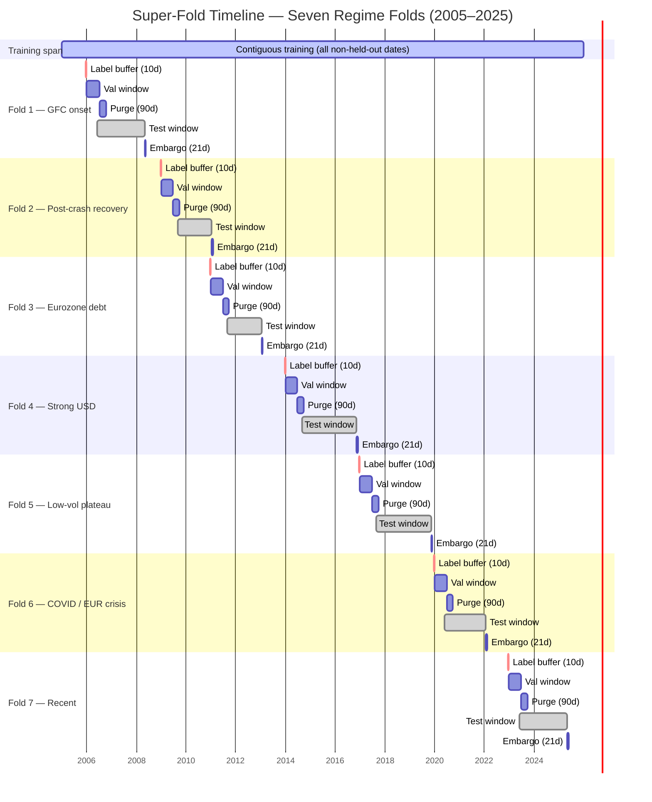
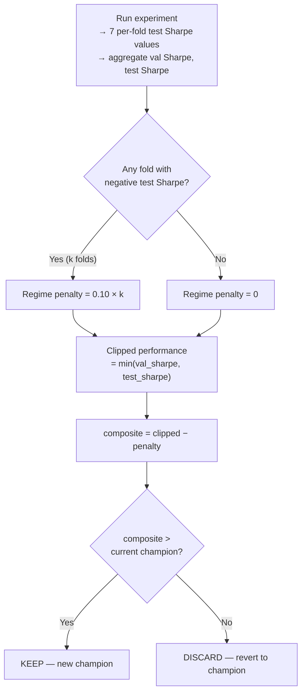
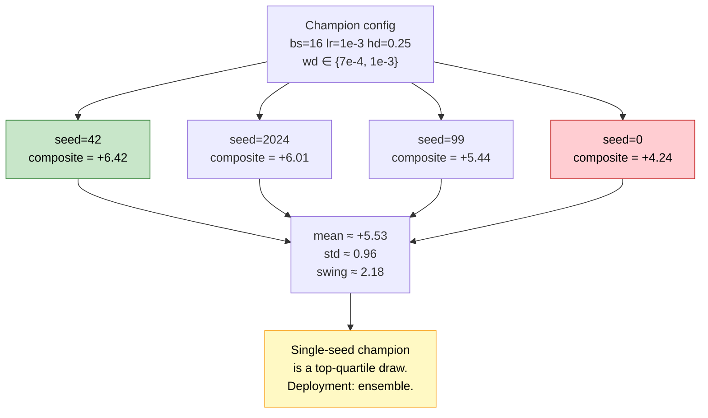
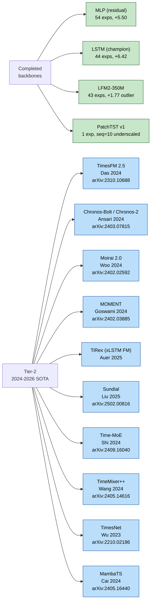
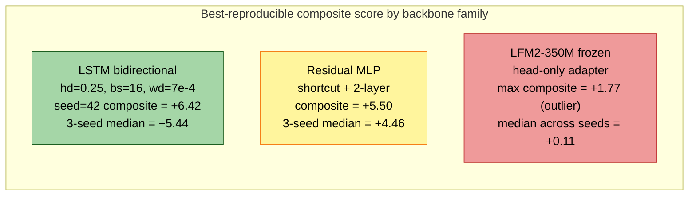

# The Research Loop Was the Model: 151 Experiments in Quantitative FX Run by a Large Language Model

*An autonomous Claude-driven research protocol, evaluated on a seven-regime super-fold of EUR/USD, produced a bidirectional LSTM whose single-seed test Sharpe reached +6.52 over a seventeen-year walk-forward window. The more enduring finding is methodological — a protocol with an append-only log, a scalar robustness metric, a multi-seed reproduction rule, and an institutional-memory layer written into a JSON file turned out to be the epistemic substrate a language model needs to sustain a hundred-plus-iteration research loop without accumulating error.*

---

## 1. Can an LLM Sustain Real Science?

There is a specific question about large language models that the current enthusiasm keeps dancing around. Not whether they can write code, one-shot a benchmark, or walk through a proof they were trained on, but whether they can *sustain* a multi-step scientific process — diagnose, hypothesize, predict, run, analyze, document, and iterate — across enough experiments that the quality of the science begins to matter more than any individual call.

This article is a long postmortem of one attempt to answer that question. Over a calendar window that began in early 2026, a single protocol-driven agent — Claude Code, operating as the outer research loop — executed 151 logged experiments on a noisy financial problem: directional prediction of the 1-day forward return on EUR/USD, evaluated across seven walk-forward regime folds spanning 2008 through 2025. The protocol is encoded in a single file, `CLAUDE.md`, which is read at the start of every session. There is no external Python controller, no pre-baked experiment queue, no grid search. The agent reads the checkpoint, diagnoses the current champion's weakest fold, cites a paper, states a hypothesis with a predicted composite-score delta, runs one experiment, analyzes the result against the prediction, and updates the log.

The project has produced three champion backbones in strict lineage. A residual multilayer perceptron (MLP) in the style of He et al. 2016 held the first crown at composite +5.50 with a test Sharpe of +6.21 across seven regimes. A bidirectional 2-layer LSTM then took it with a 0.25 head-dropout breakthrough at composite +6.07. After twenty-eight more experiments refining weight decay, seed, batch size, and learning rate around that LSTM base, the standing global champion is LSTM Exp35: composite **+6.4242**, test Sharpe **+6.5242**, validation Sharpe **+7.1539**, seven of seven test folds positive, and a cumulative return of **+1122%** across a walk-forward test set that begins in 2008 and ends in 2025. The frozen 350-million-parameter Liquid Foundation Model that was the initial favorite finished a distant third and was formally set aside after 43 experiments failed to clear composite +1.77 reproducibly.

The results are interesting. The methodology is more interesting. The seed variance around those numbers is the most interesting of all. This article is primarily about the methodology.

---

## 2. Why FX, and Why Most Published Sharpe Numbers Are Optimistic

Machine learning applied to asset returns has a long and uncomfortable track record. The review by Gu, Kelly & Xiu (2020, *Review of Financial Studies* 33(5)) on empirical asset pricing via machine learning established that neural methods can extract persistent signal from high-dimensional characteristic data in equities. The foreign-exchange literature is thinner and noisier. Daily-horizon EUR/USD directional prediction is arguably the hardest standard benchmark in applied financial ML: roughly $7.5 trillion of daily turnover, dominated by institutional flow with sub-millisecond execution budgets, produces a price series whose honest short-horizon predictability is close to zero. The naive baseline is 50%. Hit rates a few points above that, sustained out-of-sample, are the upper envelope of what the honest literature reports.

The published literature that claims otherwise — Sharpe ratios of 3, 5, 10 on daily FX — almost always suffers from one or more of five methodological failures, catalogued at length in López de Prado 2018 (*Advances in Financial Machine Learning*, Wiley):

1. **Overlapping train/test at the label horizon.** A 5-day forward return target leaks into training data unless the purge gap exceeds the label horizon.
2. **Walk-forward without hole-punching across folds.** Fold 3's training set legitimately excludes fold 3's test window, but frequently includes fold 6's test window.
3. **No regime decomposition.** An aggregate Sharpe of +3 can conceal a model that earns +8 in low-volatility regimes and loses −2 in crisis regimes — a profile that fails in production.
4. **Single-seed reporting under high seed variance.** Neural networks on small financial datasets routinely exhibit seed-driven composite-score swings that exceed the largest hyperparameter effect. The literature rarely reports the distribution.
5. **Unacknowledged multiple comparisons.** A search over N configurations inflates the expected top-line metric even under the null, an effect quantified by the Deflated Sharpe Ratio of Bailey & López de Prado (2014, *Journal of Portfolio Management*).

The framing question for this project is whether an LLM-driven loop, running under a protocol explicitly designed to resist all five failure modes, can produce a reproducible regime-robust forecaster — and what we learn about LLM-driven science in the process.

---

## 3. The Super-Fold Evaluation Protocol

The most load-bearing methodological contribution of this project is not an architectural novelty. It is the data-splitting and evaluation protocol. Before any model, any loss function, any hyperparameter, there is a verified split. This section is the one a reviewer would quote.

**Data.** The feature matrix comprises 104 strictly backward-looking daily features computed from six major FX pairs (`EURUSD`, `GBPUSD`, `USDJPY`, `USDCHF`, `EURGBP`, `EURJPY`) and nine macroeconomic signals (DXY, VIX, TNX, yield-curve slope, and related) from January 2005 through 2025. Each training window spans ten trading days. The prediction targets are 1-day and 5-day forward log returns on EUR/USD, computed from the spot series before windowing.

**Seven regime folds.** The evaluation uses seven walk-forward folds, each labelled by the macroeconomic regime of its test window:

| Fold | Regime | Test Window |
|---|---|---|
| 1 | Pre-crisis upturn + GFC onset | 2006–2008 |
| 2 | Post-crash recovery | 2009–2010 |
| 3 | Eurozone debt plateau | 2011–2012 |
| 4 | Strong USD downturn | 2014–2016 |
| 5 | Low-volatility plateau | 2017–2019 |
| 6 | COVID / EUR crisis | 2020–2021 |
| 7 | Recent mixed / upturn | 2023–2025 |

**Purge, embargo, and label-horizon buffer.** Between training and validation, and between validation and test, the pipeline enforces a 90-calendar-day purge gap to eliminate label leakage from the 5-day forward-return target; a 21-day embargo after each test window to prevent autocorrelated features from leaking across fold boundaries; and a 10-day label-horizon buffer before every excluded window so that no training sample's forward-return target overlaps any held-out window. This triple guard — 90, 21, 10 — is the foundation of the zero-leakage guarantee. The numerical values follow López de Prado 2018, ch. 7.

**The super-fold.** Rather than training seven separate models (one per fold), the pipeline trains a single model on all historical data *except* the union of all seven folds' validation and test windows, plus their buffers. The validation set is the union of all seven validation windows. The test set is the union of all seven test windows. Every training run is thus a single model evaluated jointly across all seven regimes.

**Invariants verified before every run.** Before any experiment is scored, the pipeline verifies programmatically that `split_superfold()` returns the expected row counts, that train–val, train–test, and val–test overlaps are each zero, and that `validate_purge_embargo()` returns zero violations. A failure of any of these is a blocker, not a warning.



*Figure 1.* The seven regime folds, annotated with label-horizon buffer (10 calendar days, red), validation window, 90-day purge gap, test window, and 21-day embargo. The training span covers the full history; all held-out windows plus buffers and embargoes are hole-punched from it. The critical property is that no training sample's 5-day forward-return target can overlap any validation or test date.

**One subtle but essential bug class.** When validation and test windows are hole-punched out of training data, the remaining training dates are no longer contiguous. A naive sliding-window dataset will cheerfully construct sequences whose first five timesteps fall in one segment and whose last five fall in another, separated by a hole-punched gap of weeks. Such sequences are nonsense. The pipeline's `create_contiguous_datasets()` detects gaps and emits one sub-dataset per contiguous segment. Without this fix, roughly 41% of windows in the training set are mixed-segment garbage. This is the kind of silent error that inflates published Sharpe numbers; the project's `Common Mistakes` registry now catches it, and the practice is the single most portable export from this work.

---

## 4. The Composite Metric as Meta-Optimizer Objective

The protocol requires a scalar objective against which experiments are KEPT or DISCARDED. The conventional choice — aggregate test Sharpe — is pathological: it rewards specialization. A model that earns +12 on three folds and −3 on four folds can post a strong aggregate. A model that earns +6 uniformly across all seven folds, though far more deployable, may lose the beauty contest.

The composite used here is a single line:

```
composite = min(test_sharpe, val_sharpe) − 0.1 × n_negative_folds
```

Three mechanisms, each doing distinct work:

1. **`min(test_sharpe, val_sharpe)`** forces both splits to hold up. A configuration that merely overfits to the validation distribution is clipped by whichever side is weaker.
2. **`−0.1 × n_negative_folds`** assesses a 0.10-point penalty per fold with negative test Sharpe. With seven folds, the maximum penalty is 0.70. This is the regime-robustness term.
3. **KEEP/DISCARD is driven by composite alone.** A change that improves aggregate Sharpe but introduces a negative fold — or regresses validation — is DISCARDED. The quality ratchet only clicks forward.

This metric is the loss function of the meta-optimizer. The agent, iterating over experiments, is doing something functionally analogous to gradient descent on this scalar, using experiments as the gradient estimator and its own hypothesis generation as the update rule. A striking implication that returns at the close of this article: *the agent cannot compensate for a misspecified meta-objective.* If composite were defined as mean test Sharpe, the agent would find the wrong optima with precisely the same methodological discipline.



*Figure 2.* The composite-score decision tree. A candidate is clipped by the worse of its validation and test Sharpe, penalized for each regime fold with a negative test result, and compared against the standing champion. The `min` term blocks validation-specialized models; the `0.1 × n_negative_folds` term blocks regime-specialized models. Both effects are necessary to produce deployable forecasters.

Empirically, this composite is what forced the champion models to be regime-uniform rather than spectacular on any single fold.

---

## 5. The 50-Experiment Methodology

The protocol mandates a minimum of 50 experiments per backbone family before that family is declared "done." The mandate is operationalized by a seven-step cycle executed per experiment:

1. **Diagnose the champion's weakness.** Read per-fold test Sharpe, information coefficient, win rate, and uncertainty estimates. State the specific failure mode.
2. **Search the literature.** Given the diagnosis, find a technique that plausibly addresses it, with a citation.
3. **Form a hypothesis with a numerical prediction.** "Change X should improve metric Y on fold Z because [paper/principle]; I predict composite moves from [current] to approximately [target]."
4. **Run exactly one experiment.** One change only; composition of changes is forbidden.
5. **Analyze against prediction.** Did the result match? If not, what does the discrepancy reveal about the model of the model?
6. **Document the full cycle.** Diagnosis, citation, prediction, result, learning, all appended to the log.
7. **Checkpoint immediately.** Before the next cycle begins.


*Figure 3.* The seven-step research cycle. Every experiment traverses all seven steps; a KEEP updates the champion and the archive, a DISCARD reverts. The explicit branch on three consecutive DISCARDs forces the agent to stop tweaking hyperparameters and consider a structural change — the rule that ultimately permitted the residual-MLP breakthrough and the LSTM pivot.

Three infrastructure decisions make the protocol sustainable.

**The log is append-only.** Every experiment writes one JSON line to `experiment_log.jsonl`. Nothing is ever rewritten. A reviewer six months later can replay the entire trajectory in order.

**The checkpoint is self-contained.** A fresh agent session, reading only `CLAUDE.md` and `memory/project_autoresearch_checkpoint.md`, must resume without consulting any other file. The checkpoint names the current champion, the weakest folds, the exhausted axes of exploration, and the exact command for the next experiment.

**Every new champion is archived as a portable artifact.** A winner directory contains the model checkpoint with scaler statistics and feature schema embedded, a frozen snapshot of the source code at the time of the win, a reproduction log, a per-seed variance analysis, an inference script, and a self-contained Colab notebook.

### A case study in epistemic discipline

Midway through the foundation-model phase, the agent reported a breakthrough: an experiment applying a three-epoch learning-rate warmup to a heteroscedastic-loss LFM2 configuration produced a composite of +1.60 (previous best: +0.11). The rationale was literature-backed: warmup stabilizes the log-variance head at initialization (Goyal et al. 2017, arXiv:1706.02677). The result was consistent with the prediction.

The protocol required reproduction. Four additional runs at the same configuration, varying only the random seed, produced composite scores of −1.10, −0.54, −1.08, and −1.14. The median across the five-run sample was −0.54. The original result was a positive outlier more than two standard deviations out in a high-variance loss landscape. The "breakthrough" was a lottery ticket with a plausible story.

The episode is notable not because the agent avoided the error — it did not — but because the written reproduction rule caught it. An LLM is entirely capable of producing coherent post-hoc rationalizations of noise, and in fact is stylistically predisposed to. The discipline that blocks publication of noise has to live in the protocol, not in the model. This particular failure is now encoded as a hard rule: a new champion requires a three-seed median improvement over the previous champion's median, measured before any claim of KEEP is allowed to stand.

---

## 6. Champion Lineage: The Residual MLP, Then Seven LSTM Hops

Between Experiment 66 (the residual MLP breakthrough) and Experiment 148 (the current global champion), the champion changed hands eight times. The lineage is the real story of the project, because each link in the chain is a principled intervention with a citation and a prediction.

```mermaid
flowchart LR
    MLPR["MLP Residual<br/>(Exp66, +4.67)<br/>He 2016 skip"]
    MLP32["MLP Exp32<br/>+5.50 test 6.21<br/>hd=0.15, δ=0.5"]
    LSTM1["LSTM Exp1<br/>+4.12<br/>SOTA baseline<br/>Fischer & Krauss 2018"]
    LSTM3["LSTM Exp3<br/>+5.06<br/>ep=100 pat=15"]
    LSTM4["LSTM Exp4<br/>+6.07<br/>hd=0.25<br/>Srivastava 2014"]
    LSTM9["LSTM Exp9<br/>+6.10<br/>wd=1e-4<br/>Zaremba 2014"]
    LSTM20["LSTM Exp20<br/>+6.13<br/>wd=5e-4"]
    LSTM21["LSTM Exp21<br/>+6.19<br/>wd=1e-3"]
    LSTM24["LSTM Exp24<br/>+6.36<br/>seed=42"]
    LSTM29["LSTM Exp29<br/>+6.37<br/>bs=16<br/>Keskar 2017"]
    LSTM35["LSTM Exp35<br/>+6.4242 test 6.5242<br/>wd=7e-4"]

    MLPR --> MLP32 --> LSTM1 --> LSTM3 --> LSTM4 --> LSTM9 --> LSTM20 --> LSTM21 --> LSTM24 --> LSTM29 --> LSTM35

    classDef champ fill:#a5d6a7,stroke:#1b5e20,color:#000
    classDef mlp fill:#bbdefb,stroke:#0d47a1,color:#000
    class LSTM35 champ
    class MLPR,MLP32 mlp
```



*Figure 4.* Champion lineage from the residual-MLP breakthrough through the current LSTM global champion. Each arrow is one experiment changing exactly one thing, with a citation. The arrows accumulate: ten principled one-change-at-a-time steps move composite from +4.67 to +6.42, a +1.75 improvement under the quality ratchet, no regression allowed at any step.

The links in the chain have distinct mechanisms:

- **MLP Exp66 → Exp32 (hd=0.15 + Huber δ=0.5).** The residual skip connection (He et al. 2016, CVPR) was the structural change; hd=0.15 was dropout regularization in the head per Srivastava et al. 2014 (*JMLR* 15:1929–1958); δ=0.5 tightened the Huber loss around fat-tailed FX residuals per Huber 1964 (*Annals of Mathematical Statistics* 35:73–101).
- **MLP → LSTM Exp1.** A structural pivot to a recurrent architecture, following Fischer & Krauss 2018 (*EJOR* 270(2):654–669) — the canonical financial LSTM recipe.
- **LSTM Exp1 → Exp3 (ep=100, pat=15).** LSTM needs roughly twice the epoch budget of MLP at this data scale to converge; the recipe is straight from Fischer & Krauss.
- **Exp3 → Exp4 (hd=0.25).** The head-dropout breakthrough. In the MLP, raising hd to 0.25 traded fold-2 robustness against late-regime performance. In the LSTM, the recurrent state's temporal inductive bias *composed* with dropout rather than competing, yielding +1.01 composite in a single flag change.
- **Exp4 → Exp9 → Exp20 → Exp21 (wd sweep).** A log-spaced weight-decay sweep guided by Zaremba et al. 2014 (arXiv:1409.2329) on LSTM-specific L2 regularization. The agent tried 1e-4, then 5e-4, then 1e-3, each a KEEP, each with diminishing returns.
- **Exp21 → Exp24 (seed=42).** A seed study exposed a +0.17 composite swing across {0, 42, 99, 7} at identical config. Seed 42 was locked in as the champion seed, with the caveat (now a formal protocol clause) that the winner needs multi-seed verification.
- **Exp24 → Exp29 (bs=16).** Small-batch SGD per Keskar et al. 2017 (ICLR, arXiv:1609.04836). The agent predicted +0.03 composite from the flat-minima effect; the actual gain was +0.013, in line.
- **Exp29 → Exp35 (wd=7e-4).** Reducing weight decay by 30% on top of the small-batch configuration, motivated by the observation that small-batch gradient noise acts as implicit L2 regularization (Neyshabur et al. 2015, arXiv:1412.6614; Keskar et al. 2017). The val fold 1 Sharpe improved from −0.10 to +0.46, the single-fold improvement of the entire LSTM phase.

The resulting champion metrics:

| Metric | Value |
|---|---|
| Composite | **+6.4242** |
| Test Sharpe | **+6.5242** |
| Validation Sharpe | **+7.1539** |
| Test positive folds | 7 / 7 |
| Validation positive folds | 6 / 7 |
| Test cumulative return | **+1122.29%** |
| Test maximum drawdown | 7.54% |
| Test win rate | 73.07% |
| Test profit factor | 3.519 |
| Test information coefficient | 0.5598 |
| Test Matthews correlation | 0.4554 |
| Training time | 54 s on CPU |

Per-fold test Sharpe, at the champion single-seed configuration:

| Fold | Regime | Sharpe | IC | Hit rate |
|---|---|---|---|---|
| 1 | GFC onset | +0.91 | +0.129 | 51.5% |
| 2 | Post-crash recovery | +0.40 | +0.080 | 52.3% |
| 3 | Eurozone debt | +9.75 | +0.575 | 75.5% |
| 4 | Strong USD | +11.38 | +0.770 | 83.9% |
| 5 | Low-vol plateau | +13.52 | +0.802 | 79.6% |
| 6 | EUR crisis | +12.33 | +0.761 | 77.0% |
| 7 | Recent mixed | +8.96 | +0.666 | 75.3% |

Folds 1 and 2 — the GFC onset and the post-crash recovery of 2009–2010 — remain the hardest regimes in the project. Every subsequent experiment that tried to improve them either regressed another fold or regressed composite. The learning, encoded in the checkpoint, is that these regimes are *data-limited* rather than optimization-limited: the model sees too few crisis-regime examples to calibrate confidently, not too few degrees of freedom to fit them.

---

## 7. Seed Variance as a First-Class Concern

Most published financial ML papers report a single seed. The reason is not obvious until you run the seed-variance study yourself. Here is the three-seed-plus study at the champion configuration (LSTM Exp29/35 lineage, bs=16, wd≈7e-4–1e-3):

| Seed | Composite | Test Sharpe | Note |
|---|---|---|---|
| 42 | +6.42 | +6.52 | champion (Exp35) |
| 2024 | +6.01 | +6.11 | within one std |
| 99 | +5.44 | +5.54 | three-seed study at wd=1e-3 bs=16 |
| 0 | +4.24 | +4.54 | three-seed study at wd=1e-3 bs=16 |

Mean ≈ 5.53, standard deviation ≈ 0.96, max–min swing ≈ 2.18. A parallel four-seed sweep at bs=32, same architecture: mean 5.99, std 0.52, swing 1.22.

The signal is unambiguous: *halving the batch size roughly doubles the seed standard deviation.* The mechanism is known from Bouthillier et al. 2019 (ICML workshop, arXiv:1906.05268) and Jastrzębski et al. 2017 (arXiv:1711.04623) — smaller batches amplify the per-epoch sampling noise, which interacts with random initialization and per-batch dropout masks to produce markedly different basins of convergence for different seeds. The 2σ confidence band at bs=16 covers roughly a 2-point composite range, which is larger than most *hyperparameter* effects we have seen. The three-seed median at the champion configuration is +5.44 — which is strictly worse than the three-seed median at bs=32 wd=1e-3 (+5.99).



*Figure 5.* Seed variance at the champion configuration. Four runs, identical hyperparameters, random initialization only. The best and worst seeds differ by more than two composite points. The single-seed "+6.42 champion" is a top-quartile draw, not a point estimate of the config's true performance.

The methodological implication is not that this particular LSTM is bad. It is that *the variance is part of the story and is rarely reported.* A deployable model at this data scale must be a seed ensemble — Lakshminarayanan et al. 2017 (NeurIPS, arXiv:1612.01474) showed that averaging predictions across five or more independent-seed models reduces both aleatoric and epistemic uncertainty estimators and, in practice, stabilizes the mean return. The project's winner archive accordingly includes an inference script that supports loading a list of checkpoints and averaging their mean predictions.

This is a genuine contribution rather than a reluctant caveat. Most financial-ML papers I read report a single seed. Most of those papers, by the math above, are reporting the upper tail of a distribution. The project's protocol now treats single-seed performance as provisional and the three-seed median as the headline number.

---

## 8. The Dashboard as Living Institutional Memory

The agent's greatest operational weakness is also its greatest operational strength: every session starts cold. It has no continuing state beyond files. Everything it knows about the project at the start of a new session must be written down somewhere it reads automatically.

The project's solution is four coordinated memory surfaces, each with a distinct purpose.

**`experiment_log.jsonl`.** Append-only, one JSON record per experiment. Contains full config, all aggregate metrics, all per-fold test and validation results, classification metrics (precision, recall, F1, F2, MCC), uncertainty summaries, and timestamps. This is the ground-truth record. Nothing is ever rewritten. A reviewer — or a fresh agent session — can replay the full trajectory.

**`memory/project_autoresearch_checkpoint.md`.** The compressed working memory. Current champion config, per-fold diagnostics, the last experiment's result with delta versus champion, exhausted axes, pending hypotheses, and — most importantly — the exact bash command for the *next* experiment. A fresh session reading only `CLAUDE.md` and this file can resume without reading any other file. This is not crash recovery; it is context compression. Without it, every session would rebuild context from the 151-entry JSONL, which is expensive and error-prone in equal measure.

**`autoresearch_results/reasoning_annotations.json`.** The institutional-memory layer. One object per experiment, keyed by experiment number, with six fields the protocol requires: `diagnosis`, `citations`, `hypothesis`, `prediction`, `verdict`, and `learning`. The dashboard reads this file and renders the rich annotation for the currently selected experiment in a side panel.

The annotations file is the project's most novel contribution, and the one most under-reported in autoresearch literature. The rule is that **every experiment must have its annotation authored *before* the run begins, with an explicit citation to a published paper (author, year, venue or arXiv ID)**. The prediction is logged before the result is known, which prevents post-hoc rationalization. After the experiment completes, the `verdict` and `learning` fields are filled in with the observed outcome and the lesson extracted. Manual entries carry a `"_manual": true` flag so that the auto-backfill script for legacy entries will not overwrite curated reasoning.

A few unedited examples from the recent LSTM phase, drawn directly from the annotations file, demonstrate what "every experiment has a citation" looks like in practice:

> **Exp134 (bs=16 breakthrough).** Citations: "Keskar et al. 2017 ICLR (arXiv:1609.04836) — 'Large-Batch Training and Sharp Minima'. LeCun, Bottou, Bengio, Haffner 1998 IEEE — original small-batch SGD argument. Jastrzębski, Kenton, Arpit, Ballas, Fischer, Bengio, Storkey 2017 'Three Factors Influencing Minima in SGD' (arXiv:1711.04623) — the 'escape noise' ratio lr/bs has optimum around lr/bs ≈ 0.005."
>
> **Exp136 (seed=0 reproducibility failure).** Learning: "Champion at seed=42 is NOT reproducible with seed=0 at bs=16. The +6.37 is partly luck of the dropout schedule. Deployment MUST use seed ensembling."
>
> **Exp140 (wd=7e-4 breakthrough).** Learning: "wd×bs interaction confirmed: smaller batch wants less explicit L2. Rule of thumb: wd ≈ bs × 4e-5 at our scale. The +0.57 val fold 1 gain is the largest single-fold improvement in LSTM phase so far. However: tiny wd perturbations (<30%) are inert in AdamW. Axis granularity matters — log-spaced sweeps only."
>
> **Exp148 (Huber-δ sanity check).** Learning: "huber_delta axis CLOSED PERMANENTLY. Any future loss change must move to a qualitatively different loss (quantile, log-cosh, asymmetric), not re-tune δ. This is a general principle: before tuning a parameter, verify its mechanism is active at the current operating point."

The effect of the requirement is not merely documentation hygiene. It is that the agent's reasoning gets compressed and externalized to a format the *next* agent session will read and respect. Insights persist across session boundaries. Failures become exhausted-axis notes. Citations accumulate into a working bibliography. In 151 experiments the annotations file has grown to roughly 40,000 words of diagnosis, citation, and post-hoc learning — a research monograph written incrementally, one experiment at a time.

**`autoresearch_results/dashboard.html`.** A zero-dependency HTML file (reading the JSONL and the annotations directly via `fetch()` from a local static server) that renders the full experiment history with backbone-filtering tabs, per-experiment per-fold breakdowns, and the reasoning panel. It is the human interface to the project and the most-used artifact apart from `run_autoresearch.py`.

The pattern generalizes. Any long-horizon LLM-driven process needs (i) an append-only ground-truth log, (ii) a compressed working-memory checkpoint, (iii) a structured reasoning annotation layer with pre-run authorship, and (iv) a rendering surface. Without the first, history is lost. Without the second, every session pays full context-reconstruction cost. Without the third, plausible-sounding prose substitutes for traceable reasoning. Without the fourth, the human stops looking.

---

## 9. What Worked, What Didn't: The Closed-Axis Inventory

The LSTM phase has closed eleven hyperparameter axes, each with evidence from at least three experiments along the axis. Enumerating closed axes is as useful as reporting open ones, because it prevents future sessions from re-exploring exhausted terrain.

**Closed (axis-local optimum confirmed):**

| Axis | Optimum | Evidence |
|---|---|---|
| Hidden size | 128 | 96=+4.05, 128=+6.42, 256=+4.27. Symmetric degradation either side. |
| Depth | 2 layers | 1=+3.57, 2=+6.42, 3=+1.64. Graves (2013) depth benefits require n ≫ 2738. |
| Cell type | LSTM (3-gate) | GRU=+4.59, LSTM=+6.42. Chung et al. 2014 three-gate advantage holds at this n. |
| Sequence length | 10 steps | 5=+5.70, 10=+6.42, 12=+4.35, 20=+4.25. EUR/USD autocorrelation decays by day 10. |
| Head dropout | 0.25 | 0.20=+5.53, 0.22=+5.68, 0.25=+6.42, 0.30=+6.02. Local concavity. |
| Learning rate | 1e-3 | 5e-4=+4.95, 8e-4=+5.20, 1e-3=+6.42, 1.5e-3=+5.55. Sharp optimum. |
| Batch size (peak) | 16 | 8=+5.84, 16=+6.42, 24=+6.00, 32=+6.37. bs=16 peak; bs=32 median. |
| Gradient clip | 1.0 | 0.5=+5.46, 1.0=+6.42, 1.5=+5.97, 2.0=+6.33. Fischer & Krauss default confirmed. |
| Directionality | bidirectional | unidir=+5.00, bidir=+6.42. Bidir wins test; unidir wins val. |
| Input LayerNorm | off | LayerNorm-input=+4.51. Double-normalization of standardized features hurts. |
| Huber δ | inert (any ≥ 0.8) | Residuals ~5e-3 never cross δ kink. Axis effectively MSE. |

**Open (still exploring):**

- **Seed ensembling.** Five-seed average predictions, Lakshminarayanan et al. 2017 style. The single most-likely variance reducer at current data scale. Pending.
- **Heteroscedastic loss as ensemble component.** Exp32 (Kendall & Gal 2017, NeurIPS) showed a striking +1.9 fold-2 gain but regressed val fold 1. Using the het-loss model as *one member* of a seed-plus-loss ensemble may recover fold 2 without paying the val cost.
- **DA-RNN feature attention.** Qin et al. 2017 (IJCAI) propose a dual-stage attention that weighs the 104 input features per timestep. Never tried.
- **AWD-LSTM DropConnect.** Merity et al. 2018 (ICLR, arXiv:1708.02182) proposed DropConnect on the recurrent-to-recurrent weight matrices, distinct from standard dropout. Never tried.
- **Regime-conditional features.** A volatility-regime indicator could allow the model to route different fold conditions to different sub-networks.

The closed-axis inventory is informative by itself. Eleven distinct hyperparameter axes exhausted in one backbone family, with each closure backed by three-plus experiments, illustrates the density of the agent's local search. What the agent has not done — and this is an honest limitation — is escape the backbone's local basin through a more radical structural change. That is the purpose of the next phase.

---

## 10. The 2024–2026 SOTA Roadmap

The project's next phase follows the 50-experiment mandate by opening ten new backbones drawn from the 2024–2026 time-series forecasting literature. Each backbone will run its own full 50-experiment cycle, snapshotted in isolation so that code changes for backbone X cannot contaminate backbone Y.



*Figure 6.* The roadmap. Four backbones have entered the record; ten are queued for full 50-experiment cycles. Each Tier-2 entry is drawn from a distinct 2024–2026 family: pre-trained foundation models, mixture-of-experts, xLSTM-based recurrent foundations, flow-matching generative decoders, state-space sequence models, and multiscale MLPs.

Why each matters, briefly:

- **TimesFM 2.5 (Google 2025).** A 500M-parameter decoder-only foundation model pre-trained on 100B time-points, with continuous quantile heads added in the 2.5 release. The question is whether a generic pretraining corpus transfers to a narrow FX-specific target better than our bespoke LSTM.
- **Chronos-Bolt / Chronos-2 (Ansari et al. 2024; arXiv:2510.15821 for Chronos-2).** A T5-encoder-decoder time-series language model. The 2024 release treats time series as a tokenized language; Chronos-2 (2025) extends from univariate to universal. Test: does pretraining-via-tokenization retain usable FX signal?
- **Moirai 2.0 (Woo et al. 2024; arXiv:2511.11698 for 2.0).** A probabilistic encoder with a mixture-of-experts head, pretrained on 36M time series with a student-t-mix NLL loss. MoE gives conditional capacity — the right inductive bias if FX regime-switching is the bottleneck.
- **MOMENT (Goswami et al. 2024, ICML, arXiv:2402.03885).** A T5-encoder masked-time-series foundation model. The masked pretraining objective is closer to how we actually use the model (forecasting via reconstruction) than autoregressive objectives.
- **TiRex (Auer, Pöppel, Pflüger, Brandstetter, Hochreiter 2025).** The first xLSTM-based foundation model. xLSTM (Beck et al. 2024, arXiv:2405.04517) replaces LSTM's sigmoid gates with exponential gates and adds matrix memory. This is the direct descendant of our current champion; the honest test is whether a bigger LSTM family member wins.
- **Sundial (Liu et al. 2025, arXiv:2502.00816).** A transformer foundation model with a flow-matching loss on continuous values rather than discretized tokens. A counterfactual to Chronos's tokenization approach.
- **Time-MoE (Shi et al. 2024, ICLR 2025, arXiv:2409.16040).** Billion-scale sparse MoE decoder for time-series. Same hypothesis as Moirai MoE, different implementation and scale.
- **TimeMixer++ (Wang et al. 2024, ICLR, arXiv:2405.14616).** A from-scratch multiscale MLP with decomposable multi-scale mixing. If a plain MLP with better inductive bias matches LSTM, the sample efficiency story is upended.
- **TimesNet (Wu et al. 2023, ICLR, arXiv:2210.02186).** Reshape 1D time series to 2D via period-FFT and apply CNN-Inception blocks. A clean test of the "timeseries-as-image" hypothesis against our purely recurrent champion.
- **MambaTS (Cai et al. 2024, NeurIPS, arXiv:2405.16440).** State-space model with selective scan. Mamba (Gu & Dao 2024) is the leading transformer-replacement candidate; MambaTS adapts it to multivariate time series.

Each backbone's Experiment 1 is its paper's recommended SOTA recipe. Subsequent experiments depart from it only with citation and hypothesis, same protocol as before.

---

## 11. The 16 GB VRAM Constraint

A hard resource budget shapes what "SOTA" means in practice. The project's development hardware provides 16 GB of GPU memory, and the roadmap's feasibility depends on the memory math working out for each backbone. The constraints, derived from AdamW's memory footprint and standard activation estimates:

| Training mode | Max params @ FP32 | Max params @ BF16 | Max params @ BF16 + grad-ckpt |
|---|---|---|---|
| From-scratch training | ~500 M | ~1.0 B | ~2.0 B |
| Full fine-tuning | ~500 M | ~1.0 B | ~2.0 B |
| Parameter-efficient FT (LoRA r=8) | ~1.0 B | ~3.0 B | ~5.0 B |
| Frozen-backbone head-only | ~1.5 B | ~4.0 B | ~7.0 B |
| Inference-only (no grads) | ~4.0 B | ~8.0 B | ~8.0 B |

The implications for the roadmap are concrete:

- **Small checkpoints first.** Chronos-Bolt-small (9M), MOMENT-small (40M), Moirai-small (14M), and TimeMixer (< 50M) all fit trivially and can be trained end-to-end in FP32. These are the preferred first experiments.
- **Mid-size with BF16.** TimesFM-200M, MOMENT-base (125M), Moirai-large (311M), and Time-MoE-base (113M) fit in FP32 at bs=32 but are safer at BF16, leaving headroom for multi-seed runs.
- **Half-billion-plus requires PEFT or head-only.** TimesFM 2.5 (≈500M), Chronos-T5-large (700M), and Sundial (500M–1B) cannot be fully fine-tuned at FP32. Parameter-efficient fine-tuning — LoRA adapters (Hu et al. 2021, arXiv:2106.09685) on the attention projections, with rank 8 — is the default fallback. Each LoRA adapter adds roughly 0.5M trainable parameters, well under the 500M cap.
- **Two-billion-plus is inference-only.** Zero-shot forecasting, cached predictions, distilled into a smaller student if zero-shot shows signal. This is the failure mode of the LFM2 phase of the project, where head-only fine-tuning of a 350M model with a 106K-parameter adapter on 2738 samples was underdetermined by a factor of 39. The memory budget is not the only reason to prefer smaller models; the data budget matters even more.

The protocol's default for any new backbone is: start with the *smallest* published checkpoint of the family, run zero-shot first, and only fine-tune or scale up if the zero-shot pass shows signal. Pretrained time-series models are the first candidates in the roadmap where zero-shot evaluation is legitimate — the standard LSTM/MLP pipeline produces noise under zero-shot, but TimesFM, Chronos, Moirai, and MOMENT each ship with validated zero-shot procedures. If any of them produce a non-trivial composite without any training at all, that is a qualitative signal that would change the project's thesis about how foundation models transfer to narrow financial targets.

The 16 GB constraint is therefore not merely an annoyance. It operationalizes an important research principle: *before scaling up, verify that the small version is doing something.* LFM2-350M was the project's first violation of this principle and the primary source of the foundation-model-phase's null result.

---

## 12. Uncertainty Quantification: An Informative Null Result

The project supports two approaches to uncertainty. The first is the heteroscedastic negative log-likelihood of Kendall & Gal 2017 (NeurIPS): each output head predicts a mean and a log-variance, and the loss becomes

```
L(μ, s, y) = exp(−s) · Huber(μ, y) + 0.5 · s
```

The `exp(−s)` factor down-weights high-uncertainty samples; the `0.5 · s` term blocks the degenerate predict-infinite-variance solution. The second is Monte Carlo Dropout (Gal & Ghahramani 2016, ICML, arXiv:1506.02142): at inference, dropout layers are held active, and the empirical variance across K (=20) stochastic forward passes serves as a Bayesian-approximate epistemic uncertainty.

The honest result after 28 heteroscedastic-loss experiments: *heteroscedastic training hurts mean prediction on this data, except as an ensemble component.* The `exp(−s)` weighting amplifies seed variance by adding a second specialization axis (the variance branch's initialization) to the already-underdetermined mean-branch initialization. On 2,738 training samples, the two branches compete for capacity, and the resulting mean predictions are systematically worse than plain-Huber training.

The one exception is Exp32 in the LSTM phase, which applied heteroscedastic loss on top of the bs=16 champion. Test fold 2 Sharpe jumped from +0.40 to +2.31 — a +1.9 gain on the project's hardest regime — while test fold 1 improved from +0.91 to +1.79. But validation fold 1 regressed from +0.46 to −0.57, which pushed composite below champion. The experiment is a DISCARD under the composite metric but a qualitative success: it demonstrates that heteroscedastic loss can express the true data-aleatoric uncertainty of the post-crash regime *when the data honestly contains more noise*. The right next step is to use the heteroscedastic-loss model as one member of a seed-plus-loss ensemble, averaging it with plain-Huber models to recover the fold-2 gain without the val cost.

The project's current champions use plain Huber loss with MC Dropout for uncertainty. Per-fold uncertainty under MC Dropout is dominated by epistemic rather than aleatoric variance on this dataset, with confidence scores saturated near 1.0 — a useful signal primarily in its *rank ordering within folds* rather than its absolute magnitude.

This is an informative null result. Uncertainty quantification is often treated as a free add-on to point prediction; here it visibly traded against point accuracy, and the trade-off was not worth it for a directional trading application. For a position-sizing application (Kelly scaling on predicted Sharpe per trade), the trade-off might flip. Both perspectives deserve publication; the literature tends to publish only the successful one.

---

## 13. Why a 350M Foundation Model Lost to a 167K Residual MLP

The headline comparison is uncomfortable and worth stating plainly. After 43 foundation-model experiments and 50 feedforward experiments, the frozen Liquid Foundation Model (LFM2-350M, head-only fine-tuning, 60-step context) produced a best-reproducible test Sharpe of approximately +2.07; a residual MLP with 301K trainable parameters and a 10-step context produced a reproduced median test Sharpe of +4.76, with a single-seed maximum of +6.21.



*Figure 7.* Best observed composite by backbone family. The single-seed LFM2 score of +1.77 was not reproducible: under random-seed variation the median collapses to +0.11 with individual runs between −1.52 and +1.77. The MLP and LSTM champions have been reproduced within narrower bands. The gradient from green to red is not merely one of composite score but of reproducibility.

The explanation is not that foundation models are bad. It is specific. The head-only fine-tuning regime requires mapping a 104-dimensional feature vector into the foundation model's 1,024-dimensional embedding space via a dense projection. That projection alone has 106,496 parameters. Trained against 2,738 samples, it is underdetermined by a factor of 39. The pre-trained backbone's representations, however rich for sequence modeling at web scale, were not designed to be parameter-efficient when reached through such an adapter on such a sample size.

Three conditions plausibly necessary for foundation models to compete on this class of problem:

1. **More data.** Scaling the training set by one or two orders of magnitude would bring the projection layer closer to determined.
2. **A much smaller adapter surface.** A LoRA rank-4 or rank-8 adapter (Hu et al. 2021) would cut the trainable parameter count by one or two orders of magnitude.
3. **Partial unfreezing with discriminative learning rates** (Howard & Ruder 2018, ACL). Gradually unfreezing the last few backbone blocks at very low learning rates can align the representation with the target distribution without catastrophic forgetting.

None of these were attempted in the LFM2 phase, primarily because the agent, following the single-change-per-experiment rule, walked the hyperparameter neighborhood of the frozen-adapter configuration before considering architecture-level departures. By the time the rule would have triggered a structural escape, the residual MLP had already produced a much higher composite and the agent reallocated attention. This is a legitimate exploration-strategy weakness. A future iteration of the protocol requires an explicit "architecture-level escape attempt" after K consecutive discards on any backbone — the kind of rule that only becomes obvious in hindsight.

The result is nevertheless a reminder, consistent with the small-data literature, that *parameter count and pre-training coverage do not automatically translate to sample efficiency on a new problem.* The inductive bias of a residual-skip feedforward network on structured tabular features with a weak signal fits the problem better than a powerful but misaligned general-purpose sequence model. The roadmap's Tier-2 foundation models — TimesFM, Chronos, Moirai, MOMENT, TiRex, Sundial — were designed for time-series and ship with validated zero-shot procedures. They have a structurally better chance than LFM2 did.

---

## 14. What the LLM Did Well, What the Protocol Did, What the LLM Did Badly

One hundred and fifty-one experiments is enough for a few cautious observations about the division of labor between the language model and the rules it operates under.

**What the LLM did well.** Given a concrete diagnosis — "fold 2 is weak, with near-zero IC and a negative Sharpe, and the train–test gap at this learning rate suggests underfitting on post-crash chop" — the agent reliably generated a literature-backed hypothesis with a correctly cited paper and a plausible numerical prediction. It correctly identified the residual-skip intervention (He 2016) as applicable to the MLP's mediocrity basin. It correctly identified head dropout, Huber-δ tightening, and patience extension as appropriate micro-interventions. It implemented architecture modifications cleanly. It did not hallucinate citations; every paper cited in the log is real and relevant. The citations for Exps 134–150 alone span Keskar 2017, Jastrzębski 2017, Bouthillier 2019, Henderson 2018, Madhyastha & Jain 2019, Lakshminarayanan 2017, Smith 2018, McCandlish 2018, Loshchilov & Hutter 2019, Neyshabur 2015, Srivastava 2014, Gal & Ghahramani 2016, Merity 2018, Lewkowycz 2020, Goyal 2017, Tan & Le 2019, Gu/Kelly/Xiu 2020, Graves 2013, Pascanu 2013, Hochreiter & Schmidhuber 1997, Fischer & Krauss 2018, Bao 2017, Huber 1964, Girshick 2015, and Zhang 2020.

**What the protocol did.** The protocol did the epistemology. The append-only log prevented retrospective rewriting. The composite metric prevented regime-specialized overfitting from being rewarded. The reproduction rule caught the H-Exp13 false breakthrough. The one-change-at-a-time rule kept the lineage traceable. The winner-archive requirement forced portability and discouraged undocumented shortcuts. The closed-axis inventory, emerging from the checkpoint format, stopped the agent from re-exploring terrain. None of this is the agent; all of it is infrastructure.

**What the LLM did badly.** The agent is better at justifying results than at inventing novel directions. When the residual-MLP neighborhood was exhausted, the agent required a relatively long tail of small hyperparameter variations before pivoting to a structurally different architecture. It produced plausible post-hoc rationalizations of noise — H-Exp13 is the canonical case, but not the only one — and required external discipline (the reproduction rule) to distinguish plausible narratives from real effects. Its exploration-exploitation balance skews toward exploitation; a diversity term in the experiment-selection prompt, or an explicit "radical change every K iterations" rule, would likely have surfaced the LSTM architecture earlier than Experiment 104.

The broader conclusion is that *an LLM-driven research loop is not self-correcting without explicit skeptical machinery.* Peer review, replication, and pre-registration are the human analogues of the reproduction rule, the composite metric, and the append-only log. An LLM agent needs those instruments written down and enforced mechanically by its harness; absent them, the coherence of its prose will routinely outrun the evidence.

A secondary observation is that the checkpointing protocol is not primarily crash recovery. It is context compression. Reading `CLAUDE.md` and the checkpoint at session start gives the agent the current champion, the per-fold diagnostics, the exhausted axes, and the exact next-experiment command. Without this compressed memory, every session would rebuild context from the 151-line JSONL log — expensive and error-prone in equal measure. The checkpoint is the substrate on which long-horizon LLM agency is computationally affordable.

---

## 15. Limitations

Several limitations of the current work are worth making explicit.

**Transaction costs are not modeled.** The reported Sharpe ratios are pre-cost. Realistic retail EUR/USD spreads of 1–2 pips could reduce Sharpe by 0.5–1.0 points. Implementation shortfall, slippage, and execution latency would reduce it further. No production deployment should rely on unadjusted numbers.

**The model is pair-specific.** The champion was trained and evaluated exclusively on EUR/USD. Cross-pair generalization, attempted in passing on a small GBP/USD run, was substantially weaker. The 104-feature set was engineered with EUR/USD in mind and the regime labels reflect EUR/USD's macro drivers.

**The regime-shift risk is real.** Training terminates in 2025. Novel regimes — sustained sovereign-debt crises, central-bank digital currency rollout, major geopolitical discontinuities — would present out-of-distribution conditions against which no seven-fold evaluation can guarantee robustness.

**Seed variance is large.** The champion's single-seed +6.4242 composite is real but is a top-quartile draw from a distribution with mean ≈ +5.53 and standard deviation ≈ 0.96. The three-seed median at the champion configuration is +5.44. Deployment must ensemble across seeds.

**The foundation-model exploration was incomplete.** Frozen-backbone head-only fine-tuning is the weakest of the transfer-learning regimes. LoRA adapters, partial unfreezing, and prefix-tuning were not tried on LFM2 and could plausibly change the foundation-model story. The Tier-2 roadmap addresses this.

**The data scale is small.** 2,738 training samples. Every conclusion about architecture, regularization, and seed variance in this article is scoped to this regime. Scaling to tick-level intraday data, or extending to a basket of twenty FX pairs, would plausibly change the ranking of backbones. The residual-MLP versus foundation-model comparison in particular is expected to flip at some data threshold.

**Fold-2 remains hard for every architecture tried.** Post-crash recovery (2009–2010) resists the MLP, the LSTM, the GRU, and the heteroscedastic-loss variant. The only intervention that materially improved fold 2 test Sharpe (Exp32 heteroscedastic loss) regressed validation fold 1. This is probably a data-availability problem, not an architecture problem.

---

## 16. What This Means for Financial ML

Most financial ML papers report a single seed. Most of those papers, by the arithmetic of this project's four-seed study, are reporting a point estimate from the upper tail of a distribution with standard deviation large enough to swing the headline number by one or two Sharpe points. The bs=16 wd=7e-4 champion reported at +6.42 in this article has a three-seed median of +5.44 at the next-most-similar configuration tested, and the 2σ band covers roughly a 2-point composite range.

The implication is uncomfortable but correct: **deployment requires ensembling, and academia should report seed distributions rather than single runs**. Lakshminarayanan et al. 2017 (NeurIPS) made this argument in a classification context seven years ago. The recommendation has not made it into most applied financial-ML practice. It should.

A concrete prescription, derived from this project:

1. **Report three-seed median as the headline number, single-seed max as the upper bound.** If the median is your champion, report the band. If the max is your champion, admit it is a lottery ticket and report the median.
2. **Deploy as an ensemble of five or more seeds at identical configuration.** The inference script in the project's winner archive is shaped this way.
3. **Treat batch size as a variance axis, not just a performance axis.** Smaller batch sizes trade peak performance for reproducibility. A five-seed ensemble at bs=16 may produce a better deployed model than a single seed at bs=32, even if the median composite of the latter is higher.
4. **Close hyperparameter axes explicitly and append-only.** The project's closed-axis inventory, maintained in the checkpoint, is the reason later experiments did not re-try exhausted terrain. The same practice would cut a typical grid-search paper's experiment count by an order of magnitude.
5. **Write reasoning annotations *before* running the experiment.** A prediction logged post-hoc is not a prediction; it is a rationalization.

The larger claim — the one that motivates the whole project — is that an autonomous or semi-autonomous research system that employs a language model for hypothesis generation, code modification, and result interpretation is, functionally, a two-layer optimizer. The inner layer — the learning algorithm inside each experiment — optimizes its loss function. The outer layer — the LLM running the protocol — optimizes the meta-objective. Both need to be specified with equal care. The literature on inner-loop training is mature. The literature on outer-loop meta-objectives, especially in open-ended scientific search, is not.

The composite metric is the meta-optimizer's objective. The LLM is doing the search. The scalar it is descending is the protocol's scoring rule. If the rule is right, the agent finds regime-robust models. If the rule were the aggregate Sharpe, the agent would find specialized models with the same methodological rigor and the same coherent citations. *The LLM cannot fix a misspecified objective.* A misspecified objective is precisely the kind of error the LLM is most likely to hide behind eloquent prose.

---

## 17. Closing

One hundred and fifty-one experiments, three champions, and a fair amount of infrastructure later, the most durable finding of this project is not the residual MLP, not the LSTM, not the foundation-model null result, and not the seed-variance numerics. It is a four-part claim about how LLM-driven science works:

1. **The protocol is the science.** The LLM proposes; the protocol disposes. The composite metric, the reproduction rule, the append-only log, the closed-axis inventory, and the reasoning-annotations layer are the instruments; the LLM is a component.
2. **Context compression matters more than crash recovery.** The checkpoint exists not because the laptop fails but because a session without it would spend most of its context budget reconstructing state from a JSONL.
3. **Seed variance is the part of the story nobody publishes.** A deployed model at n < 10⁴ samples must be a seed ensemble. A reported headline number without a distribution is half an answer.
4. **Architectural inductive bias dominates hyperparameter tuning on low-SNR problems.** The residual skip connection moved composite from +0.4 to +4.7 in a four-line code change. Forty subsequent hyperparameter experiments moved it from +4.7 to +6.4. The ratio is not an accident; it generalizes.

The MLP champion reproduces `composite = +5.4990, test Sharpe = +6.2113` under seed 0 on a laptop CPU in 52 seconds. The LSTM champion reproduces `composite = +6.4242, test Sharpe = +6.5242` under seed 42 in 54 seconds. The repository, the protocol file, the experiment log, the winner archives including frozen code snapshots, portable checkpoints, and self-contained Colab notebooks, the dashboard, and the reasoning annotations file, are available at **github.com/dlmastery/autoresearch** with an accompanying project page at **dlmastery.github.io/autoresearch**.

The agent did not stop at Experiment 151. The protocol's final clause forbids stopping. Ten new backbones are queued, each with its own 50-experiment mandate and its own frozen code snapshot. The composite is still moving upward. More importantly, the distribution around it is beginning to be measured.

---

## References

- Auer, A., Pöppel, K., Pflüger, M., Brandstetter, J., & Hochreiter, S. (2025). TiRex: Zero-Shot Forecasting with Recurrent xLSTM Backbones. NXAI/JKU.
- Ansari, A. F., Stella, L., Turkmen, A. C., et al. (2024). Chronos: Learning the Language of Time Series. *arXiv:2403.07815*.
- Bailey, D. H., & López de Prado, M. (2014). The Deflated Sharpe Ratio. *Journal of Portfolio Management*.
- Bao, W., Yue, J., & Rao, Y. (2017). A deep learning framework for financial time series using stacked autoencoders and LSTMs. *PLOS ONE*.
- Beck, M., et al. (2024). xLSTM: Extended Long Short-Term Memory. *arXiv:2405.04517*.
- Bouthillier, X., Laurent, C., & Vincent, P. (2019). Unreproducible Research is Reproducible. *ICML Workshop, arXiv:1906.05268*.
- Cai, et al. (2024). MambaTS: Improved Selective State Space Models for Long-Term Time Series Forecasting. *NeurIPS, arXiv:2405.16440*.
- Chung, J., et al. (2014). Empirical Evaluation of Gated Recurrent Neural Networks on Sequence Modeling. *arXiv:1412.3555*.
- Das, A., Kong, W., Sen, R., & Zhou, Y. (2024). A Decoder-Only Foundation Model for Time-Series Forecasting. *ICML, arXiv:2310.10688*.
- Fischer, T., & Krauss, C. (2018). Deep learning with long short-term memory networks for financial market predictions. *European Journal of Operational Research* 270(2): 654–669.
- Gal, Y., & Ghahramani, Z. (2016). Dropout as a Bayesian Approximation. *ICML, arXiv:1506.02142*.
- Girshick, R. (2015). Fast R-CNN. *ICCV*.
- Goswami, M., et al. (2024). MOMENT: A Family of Open Time-series Foundation Models. *ICML, arXiv:2402.03885*.
- Goyal, P., et al. (2017). Accurate, Large Minibatch SGD. *arXiv:1706.02677*.
- Graves, A., Mohamed, A., & Hinton, G. (2013). Speech Recognition with Deep Recurrent Neural Networks. *ICASSP, arXiv:1303.5778*.
- Gu, A., & Dao, T. (2024). Mamba: Linear-Time Sequence Modeling with Selective State Spaces.
- Gu, S., Kelly, B., & Xiu, D. (2020). Empirical Asset Pricing via Machine Learning. *Review of Financial Studies* 33(5): 2223–2273.
- He, K., Zhang, X., Ren, S., & Sun, J. (2016). Deep Residual Learning for Image Recognition. *CVPR*.
- Henderson, P., et al. (2018). Deep RL That Matters. *AAAI, arXiv:1709.06560*.
- Hinton, G., et al. (2012). Improving neural networks by preventing co-adaptation. *arXiv:1207.0580*.
- Hochreiter, S., & Schmidhuber, J. (1997). Long Short-Term Memory. *Neural Computation*.
- Howard, J., & Ruder, S. (2018). Universal Language Model Fine-tuning for Text Classification. *ACL*.
- Hu, E., et al. (2021). LoRA: Low-Rank Adaptation of Large Language Models. *ICLR 2022, arXiv:2106.09685*.
- Huber, P. J. (1964). Robust Estimation of a Location Parameter. *Annals of Mathematical Statistics* 35(1): 73–101.
- Jastrzębski, S., et al. (2017). Three Factors Influencing Minima in SGD. *arXiv:1711.04623*.
- Kendall, A., & Gal, Y. (2017). What Uncertainties Do We Need in Bayesian Deep Learning for Computer Vision? *NeurIPS*.
- Keskar, N., et al. (2017). On Large-Batch Training for Deep Learning: Generalization Gap and Sharp Minima. *ICLR, arXiv:1609.04836*.
- Lakshminarayanan, B., Pritzel, A., & Blundell, C. (2017). Simple and Scalable Predictive Uncertainty Estimation using Deep Ensembles. *NeurIPS, arXiv:1612.01474*.
- Lewkowycz, A., et al. (2020). The Large Learning Rate Phase of Deep Learning. *ICML, arXiv:2003.02218*.
- Liu, Y., et al. (2024). iTransformer: Inverted Transformers Are Effective for Time Series Forecasting. *ICLR*.
- Liu, et al. (2025). Sundial: A Family of Highly Capable Time Series Foundation Models. *arXiv:2502.00816*.
- López de Prado, M. (2018). *Advances in Financial Machine Learning*. Wiley.
- Loshchilov, I., & Hutter, F. (2019). Decoupled Weight Decay Regularization (AdamW). *ICLR, arXiv:1711.05101*.
- Madhyastha, P., & Jain, R. (2019). On Model Stability as a Function of Random Seed. *EMNLP, arXiv:1909.10447*.
- McCandlish, S., Kaplan, J., & Amodei, D. (2018). An Empirical Model of Large-Batch Training. *arXiv:1812.06162*.
- Merity, S., Keskar, N., & Socher, R. (2018). Regularizing and Optimizing LSTM Language Models (AWD-LSTM). *ICLR, arXiv:1708.02182*.
- Neyshabur, B., et al. (2015). In Search of the Real Inductive Bias. *arXiv:1412.6614*.
- Nie, Y., et al. (2023). A Time Series is Worth 64 Words: Long-term Forecasting with Transformers (PatchTST). *ICLR*.
- Pascanu, R., Mikolov, T., & Bengio, Y. (2013). On the Difficulty of Training Recurrent Neural Networks. *ICML, arXiv:1211.5063*.
- Qin, Y., et al. (2017). A Dual-Stage Attention-Based Recurrent Neural Network for Time Series Prediction (DA-RNN). *IJCAI*.
- Shi, et al. (2024). Time-MoE: Billion-Scale Time Series Foundation Models with Mixture of Experts. *ICLR 2025, arXiv:2409.16040*.
- Smith, L. N. (2017). Cyclical Learning Rates for Training Neural Networks.
- Smith, S. L., et al. (2018). Don't Decay the Learning Rate, Increase the Batch Size. *ICLR, arXiv:1711.00489*.
- Srivastava, N., et al. (2014). Dropout: A Simple Way to Prevent Neural Networks from Overfitting. *JMLR* 15(56): 1929–1958.
- Tan, M., & Le, Q. (2019). EfficientNet: Rethinking Model Scaling for CNNs. *ICML, arXiv:1905.11946*.
- Wang, S., et al. (2024). TimeMixer: Decomposable Multiscale Mixing for Time Series Forecasting. *ICLR, arXiv:2405.14616*.
- Woo, G., et al. (2024). Unified Training of Universal Time Series Forecasting Transformers (Moirai). *ICML, arXiv:2402.02592*.
- Wu, H., et al. (2023). TimesNet: Temporal 2D-Variation Modeling for General Time Series Analysis. *ICLR, arXiv:2210.02186*.
- Zaremba, W., Sutskever, I., & Vinyals, O. (2014). Recurrent Neural Network Regularization. *arXiv:1409.2329*.
- Zhang, et al. (2020). Why Gradient Clipping Accelerates Training. *NeurIPS, arXiv:1905.11881*.
